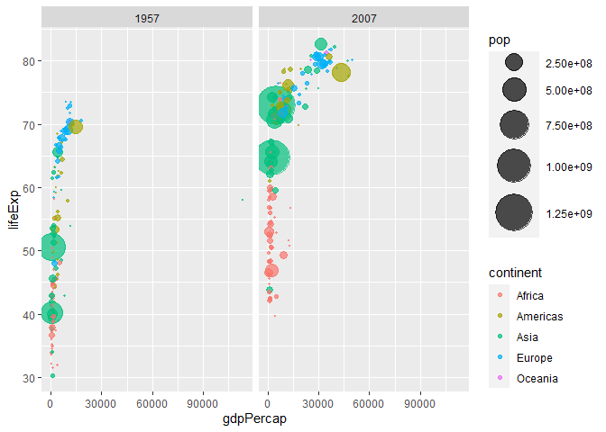

# Class 5 Data Visualization with ggplot2
Helen Le (PID A16300695)

## Using GGPLOT

The ggplot2 package needs to be installed as it does not come with R
“out of the box.”

We use the `install.packages()` function to do this.

``` r
head(cars)
```

      speed dist
    1     4    2
    2     4   10
    3     7    4
    4     7   22
    5     8   16
    6     9   10

To use ggplot, I need to load it up before I can call any of the
functions in the package. I do this with the `library()` function.

``` r
library(ggplot2)
```

All ggplot figures have at least 3 things: - data (the stuff we want to
plot) - aesthetic mapping (aed values) - geoms

``` r
ggplot(cars) +
  aes(x=speed, y=dist) +
  geom_point() +
  labs(title="Speed and Stopping Distances of Cars",
       x="Speed (MPH)",
       y="Stopping Distance (ft)",
       subtitle="Informative subtitle text here",
       caption="Dataset: 'cars'") +
  geom_smooth(method="lm", se=FALSE) +
  theme_bw()
```

    `geom_smooth()` using formula = 'y ~ x'


To figure out what parameters are able to be manipulated, hover over the
function and press ‘F1’ in RStudio. - Or, type ‘?(function_name)’ into
the R console.

ggplot is not the only graphing system in R there are lots of others.
There is even “base R” graphics.

``` r
plot(cars)
```


## 6. Creating Scatter Plots

Adding more plot aesthetics through `aes()`

``` r
url <- "https://bioboot.github.io/bimm143_S20/class-material/up_down_expression.txt"
genes <- read.delim(url)
head(genes)
```

            Gene Condition1 Condition2      State
    1      A4GNT -3.6808610 -3.4401355 unchanging
    2       AAAS  4.5479580  4.3864126 unchanging
    3      AASDH  3.7190695  3.4787276 unchanging
    4       AATF  5.0784720  5.0151916 unchanging
    5       AATK  0.4711421  0.5598642 unchanging
    6 AB015752.4 -3.6808610 -3.5921390 unchanging

``` r
nrow(genes)
```

    [1] 5196

``` r
colnames(genes)
```

    [1] "Gene"       "Condition1" "Condition2" "State"     

``` r
ncol(genes)
```

    [1] 4

``` r
table(genes["State"])
```

    State
          down unchanging         up 
            72       4997        127 

``` r
# or, table(genes$State)
round( table(genes$State)/nrow(genes) * 100, 2 )
```


          down unchanging         up 
          1.39      96.17       2.44 

- There are 5196 rows, 4 columns (“Gene”, “Condition1”, “Condition2”,
  “State”), 127 ‘up’ regulated genes, & 2.44 of the total genes are ‘up’
  regulated.

``` r
p <- ggplot(genes) +
  aes(x=Condition1, y=Condition2, col=State) +
  geom_point()

p + scale_colour_manual(values = c("blue", "gray", "red")) +
  labs(title="Gene Expression Changes Upon Drug Treatment",
       x="Control (no drug)",
       y="Drug Treatment")
```


## 7. Going further with gapminder dataset

``` r
## Remove # if packages are not already installed
# install.packages("gapminder")

## Install dplyr package to focus on a single year
# install.packages("dplyr")
```

``` r
library(gapminder)
library(dplyr)
```


    Attaching package: 'dplyr'

    The following objects are masked from 'package:stats':

        filter, lag

    The following objects are masked from 'package:base':

        intersect, setdiff, setequal, union

``` r
gapminder_2007 <- gapminder %>% filter(year==2007)

ggplot(gapminder_2007) +
  aes(x=gdpPercap, y=lifeExp, color=continent, size=pop) +
  geom_point(alpha=0.4)
```


If the plot points were colored by the numeric variable population pop:

``` r
ggplot(gapminder_2007) + 
  aes(x = gdpPercap, y = lifeExp, color = pop) +
  geom_point(alpha=0.8)
```


Adjusting point size based on the population (size=pop) of each country:

``` r
ggplot(gapminder_2007) + 
  aes(x = gdpPercap, y = lifeExp, size = pop) +
  geom_point(alpha=0.5) +
  scale_size_area(max_size = 10)
```


For the gapminder year 1957:

``` r
gapminder_1957 <- gapminder %>% filter(year==1957)

ggplot(gapminder_1957) + 
  geom_point(aes(x = gdpPercap, y = lifeExp, color=continent, size = pop), alpha=0.7) + 
  scale_size_area(max_size = 15) 
```


Comparing the years 1957 & 2007:

``` r
gapminder_1957 <- gapminder %>% filter(year==1957 | year==2007)

ggplot(gapminder_1957) + 
  geom_point(aes(x = gdpPercap, y = lifeExp, color=continent, size = pop), alpha=0.7) + 
  scale_size_area(max_size = 15) +
  facet_wrap(~year)
```



## 8. Bar Charts

``` r
gapminder_top5 <- gapminder %>% 
  filter(year==2007) %>% 
  arrange(desc(pop)) %>% 
  top_n(5, pop)

gapminder_top5
```

    # A tibble: 5 × 6
      country       continent  year lifeExp        pop gdpPercap
      <fct>         <fct>     <int>   <dbl>      <int>     <dbl>
    1 China         Asia       2007    73.0 1318683096     4959.
    2 India         Asia       2007    64.7 1110396331     2452.
    3 United States Americas   2007    78.2  301139947    42952.
    4 Indonesia     Asia       2007    70.6  223547000     3541.
    5 Brazil        Americas   2007    72.4  190010647     9066.

Creating a simple bar chart:

``` r
ggplot(gapminder_top5) + 
  geom_col(aes(x = country, y = lifeExp))
```


Filling bars with color: - `geom_col(col="gray30")` adds a grey outline
to the bars. - `guides(fill="none")` will remove the legend.

``` r
ggplot(gapminder_top5) +
  aes(x=reorder(country, -pop), y=pop, fill=gdpPercap) +
  geom_col(col="gray30") +
  guides(fill="none")
```


