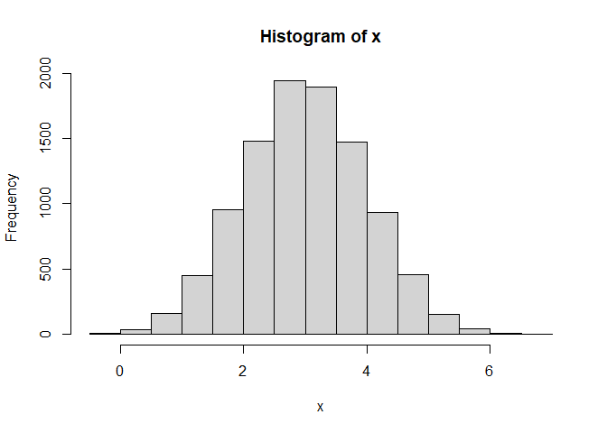
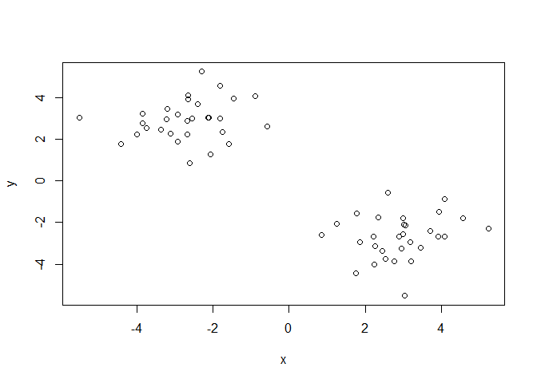
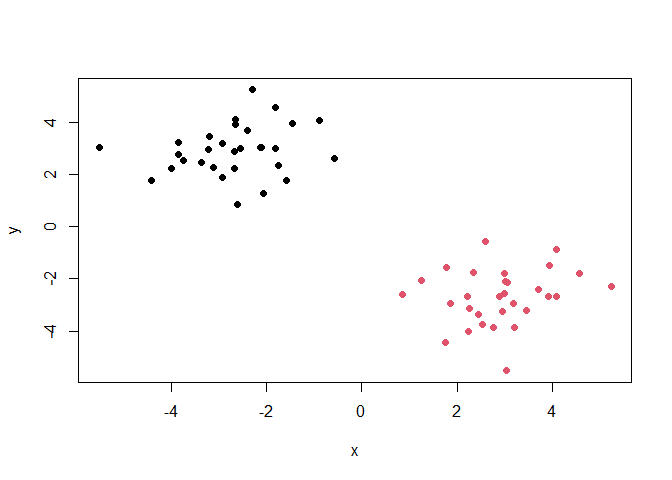
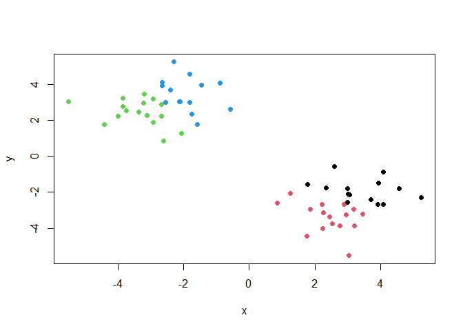
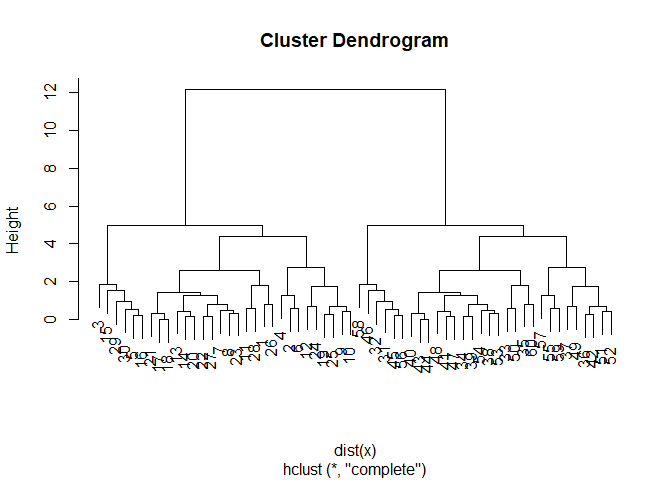
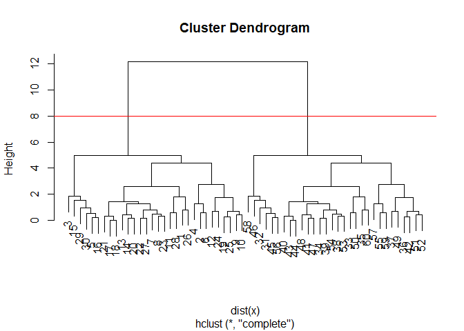
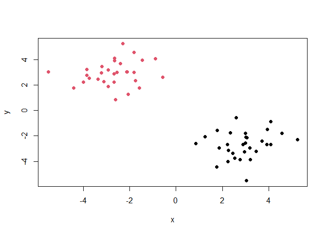
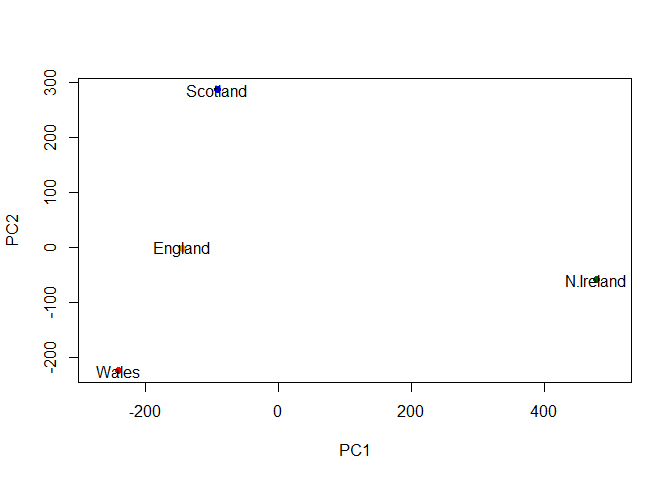
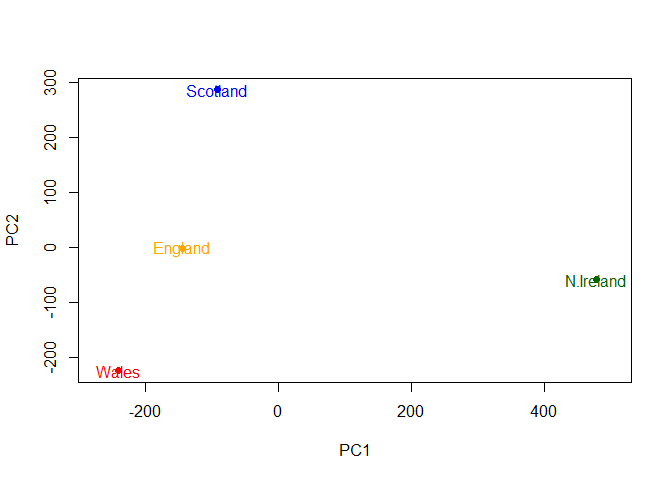

# Class 07: Machine Learning 1
Helen Le (PID: A16300695)

# Clustering

We will start today’s lab with clustering methods, in particular
so-called K-means. The main function for this in R is `kmeans()`.

Let’s try it on some made up data where weknow what the answer should
be.

``` r
x <- rnorm(10000, mean=3)
hist(x)
```



60 points

``` r
tmp <- c(rnorm(30, mean=3), rnorm(30, -3))
x <- cbind(x=tmp, y=rev(tmp))
head(x)
```

                x          y
    [1,] 4.567652 -1.8043436
    [2,] 1.780409 -1.5796453
    [3,] 3.047294 -5.5172720
    [4,] 2.597322 -0.5793765
    [5,] 2.534567 -3.7473204
    [6,] 2.351752 -1.7602141

We can pass this to the base R `plot()` function for a quick check.

``` r
plot(x)
```



``` r
k <- kmeans(x, centers=2, nstart=20)
k
```

    K-means clustering with 2 clusters of sizes 30, 30

    Cluster means:
              x         y
    1 -2.696101  2.909014
    2  2.909014 -2.696101

    Clustering vector:
     [1] 2 2 2 2 2 2 2 2 2 2 2 2 2 2 2 2 2 2 2 2 2 2 2 2 2 2 2 2 2 2 1 1 1 1 1 1 1 1
    [39] 1 1 1 1 1 1 1 1 1 1 1 1 1 1 1 1 1 1 1 1 1 1

    Within cluster sum of squares by cluster:
    [1] 58.93107 58.93107
     (between_SS / total_SS =  88.9 %)

    Available components:

    [1] "cluster"      "centers"      "totss"        "withinss"     "tot.withinss"
    [6] "betweenss"    "size"         "iter"         "ifault"      

> Q1. How many poinnts are in each cluster?

``` r
k$size
```

    [1] 30 30

> Q2. Cluster membership?

``` r
k$cluster
```

     [1] 2 2 2 2 2 2 2 2 2 2 2 2 2 2 2 2 2 2 2 2 2 2 2 2 2 2 2 2 2 2 1 1 1 1 1 1 1 1
    [39] 1 1 1 1 1 1 1 1 1 1 1 1 1 1 1 1 1 1 1 1 1 1

> Q3. Cluster centers?

``` r
k$centers
```

              x         y
    1 -2.696101  2.909014
    2  2.909014 -2.696101

> Q4. Plot my clustering results

``` r
plot(x, col=k$cluster, pch=16)
```



> Q5. Cluster the data again with kmeans() into 4 groups and plot the
> results.

``` r
k4 <- kmeans(x, centers=4, nstart=20)
plot(x, col=k4$cluster, pch=16)
```



K-means is very popular, mostly because it is fast and relatively
straightforward to run and understand. It has a big limitation in that
you need to tell it how many groups (k, or centers) you want.

# Hierarchical clustering

The main function in base R is called `hclust()`. You have to pass it in
a “distance matrix” not just your input data.

You can generate a distance matrix with the `dist()` function/

``` r
hc <- hclust(dist(x))
hc
```


    Call:
    hclust(d = dist(x))

    Cluster method   : complete 
    Distance         : euclidean 
    Number of objects: 60 

``` r
plot(hc)
```



To find the clusters (cluster membership vector) from a `hclust()`
result we can “cut” the tree at a certain height that we like. For this,
we use the `cutree()` function.

``` r
plot(hc)
abline(h=8, col="red")
```



``` r
grps <- cutree(hc, h=8)
```

``` r
table(grps)
```

    grps
     1  2 
    30 30 

> A6. Plot our hclust results.

``` r
plot(x, col=grps, pch=16)
```



# 1. PCA of UK food data

Let’s see how PCA can help us but first we can try conventional
analysis.

``` r
url <- "https://tinyurl.com/UK-foods"
x <- read.csv(url, row.names = 1)
dim(x)
```

    [1] 17  4

**Q1. How many rows and columns are in your new data frame named x? What
R functions could you use to answer this questions?** There are 17 rows
& 5 columns in the new data frame, x. This can be solved through the
functions `dim()`, `nrow()`, and `ncol()`.

``` r
# Note how the minus indexing works
rownames(x) <- x[,1]
x <- x[,-1]
head(x)
```

        Wales Scotland N.Ireland
    105   103      103        66
    245   227      242       267
    685   803      750       586
    147   160      122        93
    193   235      184       209
    156   175      147       139

``` r
dim(x)
```

    [1] 17  3

``` r
x <- read.csv(url, row.names=1)
head(x)
```

                   England Wales Scotland N.Ireland
    Cheese             105   103      103        66
    Carcass_meat       245   227      242       267
    Other_meat         685   803      750       586
    Fish               147   160      122        93
    Fats_and_oils      193   235      184       209
    Sugars             156   175      147       139

**Q2. Which approach to solving the ‘row-names problem’ mentioned above
do you prefer and why? Is one approach more robust than another under
certain circumstances?** The second method is more preferable since the
first method may keep removing columns if the code block is run multiple
times.

``` r
barplot(as.matrix(x), beside=T, col=rainbow(nrow(x)))
```


**Q3: Changing what optional argument in the above barplot() function
results in the following plot?** In the `barplot()` function, make the
argument `beside=FALSE`.

``` r
barplot(as.matrix(x), beside=F, col=rainbow(nrow(x)))
```


**Q5: Generating all pairwise plots may help somewhat. Can you make
sense of the following code and resulting figure? What does it mean if a
given point lies on the diagonal for a given plot?**

``` r
pairs(x, col=rainbow(10), pch=16)
```


The `pairs()` function creates a matrix of scatterplots using the data
frame, x, that compares the data points between two categories. If a
given point lies on the diagonal for a given plot, it means that the
amount being consumed in one country matches the amount being consumed
in another. More data points on the diagonal indicate more similarity
between the two groups, and vice versa.

**Q6. What is the main differences between N. Ireland and the other
countries of the UK in terms of this data-set?**

The main difference is that there is a visible dissimilarity between N.
Ireland and the other countries as the compared plots have many points
that don’t fall on the diagonal.

## Principal Component Analysis (PCA)

PCA can help us make sense of these types of datasets. Let’s see how it
works.

The main function in “base” R is called `prcomp()`. In this case, we
want to first take the transpose of our input `x` so the columns are the
food types and the countries are the rows

``` r
head(t(x))
```

              Cheese Carcass_meat  Other_meat  Fish Fats_and_oils  Sugars
    England      105           245         685  147            193    156
    Wales        103           227         803  160            235    175
    Scotland     103           242         750  122            184    147
    N.Ireland     66           267         586   93            209    139
              Fresh_potatoes  Fresh_Veg  Other_Veg  Processed_potatoes 
    England               720        253        488                 198
    Wales                 874        265        570                 203
    Scotland              566        171        418                 220
    N.Ireland            1033        143        355                 187
              Processed_Veg  Fresh_fruit  Cereals  Beverages Soft_drinks 
    England              360         1102     1472        57         1374
    Wales                365         1137     1582        73         1256
    Scotland             337          957     1462        53         1572
    N.Ireland            334          674     1494        47         1506
              Alcoholic_drinks  Confectionery 
    England                 375             54
    Wales                   475             64
    Scotland                458             62
    N.Ireland               135             41

``` r
pca <- prcomp(t(x))
summary(pca)
```

    Importance of components:
                                PC1      PC2      PC3       PC4
    Standard deviation     324.1502 212.7478 73.87622 3.176e-14
    Proportion of Variance   0.6744   0.2905  0.03503 0.000e+00
    Cumulative Proportion    0.6744   0.9650  1.00000 1.000e+00

``` r
pca$x
```

                     PC1         PC2        PC3           PC4
    England   -144.99315   -2.532999 105.768945 -4.894696e-14
    Wales     -240.52915 -224.646925 -56.475555  5.700024e-13
    Scotland   -91.86934  286.081786 -44.415495 -7.460785e-13
    N.Ireland  477.39164  -58.901862  -4.877895  2.321303e-13

**Q7. Complete the code below to generate a plot of PC1 vs PC2. The
second line adds text labels over the data points.**

``` r
plot(pca$x[,1], pca$x[,2], col=c("orange", "red", "blue", "darkgreen"), pch=16, xlab="PC1", ylab="PC2", xlim=c(-270,500))
text(pca$x[,1], pca$x[,2], colnames(x))
```



**Q8. Customize your plot so that the colors of the country names match
the colors in our UK and Ireland map and table at start of this
document.**

``` r
plot(pca$x[,1], pca$x[,2], col=c("orange", "red", "blue", "darkgreen"), pch=16, xlab="PC1", ylab="PC2", xlim=c(-270,500))
text(pca$x[,1], pca$x[,2], colnames(x), col=c("orange", "red", "blue", "darkgreen"))
```



The “loadings” tell us how much the original variables ( in our case,
the foods) contribute to the new variables (i.e. the PCs)

``` r
head(pca$rotation)
```

                            PC1         PC2         PC3          PC4
    Cheese         -0.056955380  0.01601285  0.02394295 -0.694538519
    Carcass_meat    0.047927628  0.01391582  0.06367111  0.489884628
    Other_meat     -0.258916658 -0.01533114 -0.55384854  0.279023718
    Fish           -0.084414983 -0.05075495  0.03906481 -0.008483145
    Fats_and_oils  -0.005193623 -0.09538866 -0.12522257  0.076097502
    Sugars         -0.037620983 -0.04302170 -0.03605745  0.034101334

``` r
## Lets focus on PC1 as it accounts for > 90% of variance 
par(mar=c(10, 3, 0.35, 0))
barplot( pca$rotation[,1], las=2 )
```


**Q9: Generate a similar ‘loadings plot’ for PC2. What two food groups
feature prominently and what does PC2 mainly tell us about?**

``` r
par(mar=c(10, 3, 0.35, 0))
barplot( pca$rotation[,2], las=2 )
```


The two prominently featured food groups here are “fresh potatoes” and
“soft drinks”. PC2 mainly tells us about the second greatest amount of
variance among the variables in the data set.
