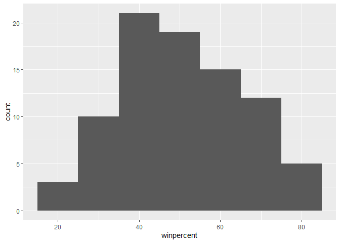

# Class 09: Halloween Candy Mini Project
Helen Le (PID: A16300695)

Today is Halloween! We will apply lots of the analysis methods and R
graphics approaches to find out all about typical Halloween candy.

``` r
candy_file <- "https://raw.githubusercontent.com/fivethirtyeight/data/master/candy-power-ranking/candy-data.csv"

candy <- read.csv(candy_file, row.names=1)
head(candy)
```

                 chocolate fruity caramel peanutyalmondy nougat crispedricewafer
    100 Grand            1      0       1              0      0                1
    3 Musketeers         1      0       0              0      1                0
    One dime             0      0       0              0      0                0
    One quarter          0      0       0              0      0                0
    Air Heads            0      1       0              0      0                0
    Almond Joy           1      0       0              1      0                0
                 hard bar pluribus sugarpercent pricepercent winpercent
    100 Grand       0   1        0        0.732        0.860   66.97173
    3 Musketeers    0   1        0        0.604        0.511   67.60294
    One dime        0   0        0        0.011        0.116   32.26109
    One quarter     0   0        0        0.011        0.511   46.11650
    Air Heads       0   0        0        0.906        0.511   52.34146
    Almond Joy      0   1        0        0.465        0.767   50.34755

**Q1. How many different candy types are in this dataset?**

``` r
dim(candy)
```

    [1] 85 12

There are 85 different candy types in this dataset.

**Q2. How many fruity candy types are in the dataset?**

``` r
sum(candy["fruity"])
```

    [1] 38

``` r
# or, sum(candy$fruity)
```

There are 38 fruity candy types.

I can convert the 1 and 0 values to be TRUE or FALSE and use that to
extract the tpe of candy I want. For example:

``` r
candy[as.logical(candy$chocolate),]
```

                                chocolate fruity caramel peanutyalmondy nougat
    100 Grand                           1      0       1              0      0
    3 Musketeers                        1      0       0              0      1
    Almond Joy                          1      0       0              1      0
    Baby Ruth                           1      0       1              1      1
    Charleston Chew                     1      0       0              0      1
    Hershey's Kisses                    1      0       0              0      0
    Hershey's Krackel                   1      0       0              0      0
    Hershey's Milk Chocolate            1      0       0              0      0
    Hershey's Special Dark              1      0       0              0      0
    Junior Mints                        1      0       0              0      0
    Kit Kat                             1      0       0              0      0
    Peanut butter M&M's                 1      0       0              1      0
    M&M's                               1      0       0              0      0
    Milk Duds                           1      0       1              0      0
    Milky Way                           1      0       1              0      1
    Milky Way Midnight                  1      0       1              0      1
    Milky Way Simply Caramel            1      0       1              0      0
    Mounds                              1      0       0              0      0
    Mr Good Bar                         1      0       0              1      0
    Nestle Butterfinger                 1      0       0              1      0
    Nestle Crunch                       1      0       0              0      0
    Peanut M&Ms                         1      0       0              1      0
    Reese's Miniatures                  1      0       0              1      0
    Reese's Peanut Butter cup           1      0       0              1      0
    Reese's pieces                      1      0       0              1      0
    Reese's stuffed with pieces         1      0       0              1      0
    Rolo                                1      0       1              0      0
    Sixlets                             1      0       0              0      0
    Nestle Smarties                     1      0       0              0      0
    Snickers                            1      0       1              1      1
    Snickers Crisper                    1      0       1              1      0
    Tootsie Pop                         1      1       0              0      0
    Tootsie Roll Juniors                1      0       0              0      0
    Tootsie Roll Midgies                1      0       0              0      0
    Tootsie Roll Snack Bars             1      0       0              0      0
    Twix                                1      0       1              0      0
    Whoppers                            1      0       0              0      0
                                crispedricewafer hard bar pluribus sugarpercent
    100 Grand                                  1    0   1        0        0.732
    3 Musketeers                               0    0   1        0        0.604
    Almond Joy                                 0    0   1        0        0.465
    Baby Ruth                                  0    0   1        0        0.604
    Charleston Chew                            0    0   1        0        0.604
    Hershey's Kisses                           0    0   0        1        0.127
    Hershey's Krackel                          1    0   1        0        0.430
    Hershey's Milk Chocolate                   0    0   1        0        0.430
    Hershey's Special Dark                     0    0   1        0        0.430
    Junior Mints                               0    0   0        1        0.197
    Kit Kat                                    1    0   1        0        0.313
    Peanut butter M&M's                        0    0   0        1        0.825
    M&M's                                      0    0   0        1        0.825
    Milk Duds                                  0    0   0        1        0.302
    Milky Way                                  0    0   1        0        0.604
    Milky Way Midnight                         0    0   1        0        0.732
    Milky Way Simply Caramel                   0    0   1        0        0.965
    Mounds                                     0    0   1        0        0.313
    Mr Good Bar                                0    0   1        0        0.313
    Nestle Butterfinger                        0    0   1        0        0.604
    Nestle Crunch                              1    0   1        0        0.313
    Peanut M&Ms                                0    0   0        1        0.593
    Reese's Miniatures                         0    0   0        0        0.034
    Reese's Peanut Butter cup                  0    0   0        0        0.720
    Reese's pieces                             0    0   0        1        0.406
    Reese's stuffed with pieces                0    0   0        0        0.988
    Rolo                                       0    0   0        1        0.860
    Sixlets                                    0    0   0        1        0.220
    Nestle Smarties                            0    0   0        1        0.267
    Snickers                                   0    0   1        0        0.546
    Snickers Crisper                           1    0   1        0        0.604
    Tootsie Pop                                0    1   0        0        0.604
    Tootsie Roll Juniors                       0    0   0        0        0.313
    Tootsie Roll Midgies                       0    0   0        1        0.174
    Tootsie Roll Snack Bars                    0    0   1        0        0.465
    Twix                                       1    0   1        0        0.546
    Whoppers                                   1    0   0        1        0.872
                                pricepercent winpercent
    100 Grand                          0.860   66.97173
    3 Musketeers                       0.511   67.60294
    Almond Joy                         0.767   50.34755
    Baby Ruth                          0.767   56.91455
    Charleston Chew                    0.511   38.97504
    Hershey's Kisses                   0.093   55.37545
    Hershey's Krackel                  0.918   62.28448
    Hershey's Milk Chocolate           0.918   56.49050
    Hershey's Special Dark             0.918   59.23612
    Junior Mints                       0.511   57.21925
    Kit Kat                            0.511   76.76860
    Peanut butter M&M's                0.651   71.46505
    M&M's                              0.651   66.57458
    Milk Duds                          0.511   55.06407
    Milky Way                          0.651   73.09956
    Milky Way Midnight                 0.441   60.80070
    Milky Way Simply Caramel           0.860   64.35334
    Mounds                             0.860   47.82975
    Mr Good Bar                        0.918   54.52645
    Nestle Butterfinger                0.767   70.73564
    Nestle Crunch                      0.767   66.47068
    Peanut M&Ms                        0.651   69.48379
    Reese's Miniatures                 0.279   81.86626
    Reese's Peanut Butter cup          0.651   84.18029
    Reese's pieces                     0.651   73.43499
    Reese's stuffed with pieces        0.651   72.88790
    Rolo                               0.860   65.71629
    Sixlets                            0.081   34.72200
    Nestle Smarties                    0.976   37.88719
    Snickers                           0.651   76.67378
    Snickers Crisper                   0.651   59.52925
    Tootsie Pop                        0.325   48.98265
    Tootsie Roll Juniors               0.511   43.06890
    Tootsie Roll Midgies               0.011   45.73675
    Tootsie Roll Snack Bars            0.325   49.65350
    Twix                               0.906   81.64291
    Whoppers                           0.848   49.52411

# 2. What’s your favorite candy

**Q3. What is your favorite candy in the dataset and what is it’s
winpercent value?**

``` r
candy["Reese's Peanut Butter cup", ]$winpercent
```

    [1] 84.18029

My favorite candy has a win percent of 84.18%.

**Q4. What is the winpercent value for “Kit Kat”?**

``` r
candy["Kit Kat",]$winpercent
```

    [1] 76.7686

Kit Kat has a winpercent value of 76.77%.

**Q5. What is the winpercent value for “Tootsie Roll Snack Bars”?**

``` r
candy["Tootsie Roll Snack Bars",]$winpercent
```

    [1] 49.6535

Tootsie Roll Snack Bars have a winpercent value of 49.65%.

The “skimr” package has a function that helps to give a quick overview
of a given dataset.

``` r
library("skimr")
skim(candy)
```

|                                                  |       |
|:-------------------------------------------------|:------|
| Name                                             | candy |
| Number of rows                                   | 85    |
| Number of columns                                | 12    |
| \_\_\_\_\_\_\_\_\_\_\_\_\_\_\_\_\_\_\_\_\_\_\_   |       |
| Column type frequency:                           |       |
| numeric                                          | 12    |
| \_\_\_\_\_\_\_\_\_\_\_\_\_\_\_\_\_\_\_\_\_\_\_\_ |       |
| Group variables                                  | None  |

Data summary

**Variable type: numeric**

| skim_variable    | n_missing | complete_rate |  mean |    sd |    p0 |   p25 |   p50 |   p75 |  p100 | hist  |
|:-----------------|----------:|--------------:|------:|------:|------:|------:|------:|------:|------:|:------|
| chocolate        |         0 |             1 |  0.44 |  0.50 |  0.00 |  0.00 |  0.00 |  1.00 |  1.00 | ▇▁▁▁▆ |
| fruity           |         0 |             1 |  0.45 |  0.50 |  0.00 |  0.00 |  0.00 |  1.00 |  1.00 | ▇▁▁▁▆ |
| caramel          |         0 |             1 |  0.16 |  0.37 |  0.00 |  0.00 |  0.00 |  0.00 |  1.00 | ▇▁▁▁▂ |
| peanutyalmondy   |         0 |             1 |  0.16 |  0.37 |  0.00 |  0.00 |  0.00 |  0.00 |  1.00 | ▇▁▁▁▂ |
| nougat           |         0 |             1 |  0.08 |  0.28 |  0.00 |  0.00 |  0.00 |  0.00 |  1.00 | ▇▁▁▁▁ |
| crispedricewafer |         0 |             1 |  0.08 |  0.28 |  0.00 |  0.00 |  0.00 |  0.00 |  1.00 | ▇▁▁▁▁ |
| hard             |         0 |             1 |  0.18 |  0.38 |  0.00 |  0.00 |  0.00 |  0.00 |  1.00 | ▇▁▁▁▂ |
| bar              |         0 |             1 |  0.25 |  0.43 |  0.00 |  0.00 |  0.00 |  0.00 |  1.00 | ▇▁▁▁▂ |
| pluribus         |         0 |             1 |  0.52 |  0.50 |  0.00 |  0.00 |  1.00 |  1.00 |  1.00 | ▇▁▁▁▇ |
| sugarpercent     |         0 |             1 |  0.48 |  0.28 |  0.01 |  0.22 |  0.47 |  0.73 |  0.99 | ▇▇▇▇▆ |
| pricepercent     |         0 |             1 |  0.47 |  0.29 |  0.01 |  0.26 |  0.47 |  0.65 |  0.98 | ▇▇▇▇▆ |
| winpercent       |         0 |             1 | 50.32 | 14.71 | 22.45 | 39.14 | 47.83 | 59.86 | 84.18 | ▃▇▆▅▂ |

**Q6. Is there any variable/column that looks to be on a different scale
to the majority of the other columns in the dataset?** The winpercent
variable looks to be on a different scale to the majority of the other
columns.

**Q7. What do you think a zero and one represent for the
candy\$chocolate column?** A zero and one likely represents logicals for
the candy types, determining whether it is TRUE or FALSE that the candy
type is considered chocolate or not.

**Q8. Plot a histogram of winpercent values**

``` r
library(ggplot2)
```

``` r
hist(candy$winpercent)
```


``` r
ggplot(candy) +
  aes(winpercent) +
  geom_histogram(binwidth=10)
```



**Q9. Is the distribution of winpercent values symmetrical?** No,
they’re not symmetrical.

**Q10. Is the center of the distribution above or below 50%?** The
center of distribution is below 50%.

**Q11. On average is chocolate candy higher or lower ranked than fruit
candy?**

``` r
choco.win <- candy$winpercent[as.logical(candy$chocolate)]
fruit.win <- candy$winpercent[as.logical(candy$fruity)]

mean(choco.win)
```

    [1] 60.92153

``` r
mean(fruit.win)
```

    [1] 44.11974

Another way to do this is:

``` r
choc.inds <- as.logical(candy$chocolate)
choc.win <- candy[choc.inds, "winpercent"]
choc.win
```

     [1] 66.97173 67.60294 50.34755 56.91455 38.97504 55.37545 62.28448 56.49050
     [9] 59.23612 57.21925 76.76860 71.46505 66.57458 55.06407 73.09956 60.80070
    [17] 64.35334 47.82975 54.52645 70.73564 66.47068 69.48379 81.86626 84.18029
    [25] 73.43499 72.88790 65.71629 34.72200 37.88719 76.67378 59.52925 48.98265
    [33] 43.06890 45.73675 49.65350 81.64291 49.52411

On average, chocolate candy is ranked higher than fruit candy.

**Q12. Is this difference statistically significant?**

``` r
t.test(choco.win, fruit.win)
```


        Welch Two Sample t-test

    data:  choco.win and fruit.win
    t = 6.2582, df = 68.882, p-value = 2.871e-08
    alternative hypothesis: true difference in means is not equal to 0
    95 percent confidence interval:
     11.44563 22.15795
    sample estimates:
    mean of x mean of y 
     60.92153  44.11974 

This difference is statistically significant as the two-sample t-test
yielded a low p-value of 2.871e-08.

# 3. Overall Candy Rankings

**Q13. What are the five least liked candy types in this set?**

``` r
head(candy[order(candy$winpercent),], n=5)
```

                       chocolate fruity caramel peanutyalmondy nougat
    Nik L Nip                  0      1       0              0      0
    Boston Baked Beans         0      0       0              1      0
    Chiclets                   0      1       0              0      0
    Super Bubble               0      1       0              0      0
    Jawbusters                 0      1       0              0      0
                       crispedricewafer hard bar pluribus sugarpercent pricepercent
    Nik L Nip                         0    0   0        1        0.197        0.976
    Boston Baked Beans                0    0   0        1        0.313        0.511
    Chiclets                          0    0   0        1        0.046        0.325
    Super Bubble                      0    0   0        0        0.162        0.116
    Jawbusters                        0    1   0        1        0.093        0.511
                       winpercent
    Nik L Nip            22.44534
    Boston Baked Beans   23.41782
    Chiclets             24.52499
    Super Bubble         27.30386
    Jawbusters           28.12744

``` r
library(dplyr)
```


    Attaching package: 'dplyr'

    The following objects are masked from 'package:stats':

        filter, lag

    The following objects are masked from 'package:base':

        intersect, setdiff, setequal, union

``` r
candy %>% arrange(winpercent) %>% head(5)
```

                       chocolate fruity caramel peanutyalmondy nougat
    Nik L Nip                  0      1       0              0      0
    Boston Baked Beans         0      0       0              1      0
    Chiclets                   0      1       0              0      0
    Super Bubble               0      1       0              0      0
    Jawbusters                 0      1       0              0      0
                       crispedricewafer hard bar pluribus sugarpercent pricepercent
    Nik L Nip                         0    0   0        1        0.197        0.976
    Boston Baked Beans                0    0   0        1        0.313        0.511
    Chiclets                          0    0   0        1        0.046        0.325
    Super Bubble                      0    0   0        0        0.162        0.116
    Jawbusters                        0    1   0        1        0.093        0.511
                       winpercent
    Nik L Nip            22.44534
    Boston Baked Beans   23.41782
    Chiclets             24.52499
    Super Bubble         27.30386
    Jawbusters           28.12744

The five least liked candy types in this set are Nik L Nip, Boston Baked
Beans, Chiclets, Super Bubble, and Jawbusters.

**Q14. What are the top 5 all time favorite candy types out of this
set?**

``` r
head(candy[order(candy$winpercent, decreasing=TRUE),], n=5)
```

                              chocolate fruity caramel peanutyalmondy nougat
    Reese's Peanut Butter cup         1      0       0              1      0
    Reese's Miniatures                1      0       0              1      0
    Twix                              1      0       1              0      0
    Kit Kat                           1      0       0              0      0
    Snickers                          1      0       1              1      1
                              crispedricewafer hard bar pluribus sugarpercent
    Reese's Peanut Butter cup                0    0   0        0        0.720
    Reese's Miniatures                       0    0   0        0        0.034
    Twix                                     1    0   1        0        0.546
    Kit Kat                                  1    0   1        0        0.313
    Snickers                                 0    0   1        0        0.546
                              pricepercent winpercent
    Reese's Peanut Butter cup        0.651   84.18029
    Reese's Miniatures               0.279   81.86626
    Twix                             0.906   81.64291
    Kit Kat                          0.511   76.76860
    Snickers                         0.651   76.67378

The top 5 all time favorite candy types out of this set are Reese’s
Peanut Butter cup, Reese’s Miniatures, Twix, Kit Kat, and Snickers.

**Q15. Make a first barplot of candy ranking based on winpercent
values.**

``` r
ggplot(candy) + 
  aes(winpercent, rownames(candy)) +
  geom_col()
```


**Q16. This is quite ugly, use the reorder() function to get the bars
sorted by winpercent?**

``` r
ggplot(candy) +
  aes(winpercent, reorder(rownames(candy),winpercent)) +
  geom_col()
```


Let’s add a color vector to our plot.

``` r
my_cols=rep("black", nrow(candy))
my_cols[as.logical(candy$chocolate)] = "chocolate"
my_cols[as.logical(candy$bar)] = "brown"
my_cols[as.logical(candy$fruity)] = "pink"
```

``` r
ggplot(candy) + 
  aes(winpercent, reorder(rownames(candy),winpercent)) +
  geom_col(fill=my_cols) 
```


**Q17. What is the worst ranked chocolate candy?** The worst ranked
chocolate candy is Sixlets.

**Q18. What is the best ranked fruity candy?** The best ranked fruity
candy is Starburst.

# 4. Taking a look at pricepercent

``` r
library(ggrepel)

# Plot of price vs. winpercent
ggplot(candy) +
  aes(winpercent, pricepercent, label=rownames(candy)) +
  geom_point(col=my_cols) + 
  geom_text_repel(col=my_cols, size=3.3, max.overlaps = 8)
```

    Warning: ggrepel: 33 unlabeled data points (too many overlaps). Consider
    increasing max.overlaps


`geom_text_repel()` moves around the labels so that the text becomes
more legible on the plot.

**Q19. Which candy type is the highest ranked in terms of winpercent for
the least money - i.e. offers the most bang for your buck?** Reese’s
Miniatures is the candy type that is ranked the highest in terms of
winpercent for the least money.

**Q20. What are the top 5 most expensive candy types in the dataset and
of these which is the least popular?**

``` r
ord <- order(candy$pricepercent, decreasing = TRUE)
head( candy[ord,c(11,12)], n=5 )
```

                             pricepercent winpercent
    Nik L Nip                       0.976   22.44534
    Nestle Smarties                 0.976   37.88719
    Ring pop                        0.965   35.29076
    Hershey's Krackel               0.918   62.28448
    Hershey's Milk Chocolate        0.918   56.49050

The top 5 most expensive candy types in the data set are Nik L Nip, Ring
pop, Nestle Smarties, Hershey’s Krackel, and Hershey’s Milk Chocolare.
Of these, Nik L Nip is the least popular.

# 5. Exploring Correlation Structure

``` r
library(corrplot)
```

    corrplot 0.92 loaded

``` r
cij <- cor(candy)
corrplot(cij)
```


**Q22. Examining this plot what two variables are anti-correlated
(i.e. have minus values)?** Chocolate and fruity candy types are
anti-correlated. (They are negatively associated with each other.) This
makes sense since you don’t often see chocolatey fruity candies.

**Q23. Similarly, what two variables are most positively correlated?**
Chocolate and bar candy types are the most positively correlated. This
makes sense since chocolate candies come in a bar form.

# 6. Principal Component Analysis

``` r
pca <- prcomp(candy, scale=TRUE)
summary(pca)
```

    Importance of components:
                              PC1    PC2    PC3     PC4    PC5     PC6     PC7
    Standard deviation     2.0788 1.1378 1.1092 1.07533 0.9518 0.81923 0.81530
    Proportion of Variance 0.3601 0.1079 0.1025 0.09636 0.0755 0.05593 0.05539
    Cumulative Proportion  0.3601 0.4680 0.5705 0.66688 0.7424 0.79830 0.85369
                               PC8     PC9    PC10    PC11    PC12
    Standard deviation     0.74530 0.67824 0.62349 0.43974 0.39760
    Proportion of Variance 0.04629 0.03833 0.03239 0.01611 0.01317
    Cumulative Proportion  0.89998 0.93832 0.97071 0.98683 1.00000

``` r
plot(pca$x[,1:2])
```


``` r
plot(pca$x[,1:2], col=my_cols, pch=16)
```


Let’s try to plot the same thing using ggplot2.

``` r
# Make a new data-frame with our PCA results and candy data
my_data <- cbind(candy, pca$x[,1:3])

p <- ggplot(my_data) + 
        aes(x=PC1, y=PC2, 
            size=winpercent/100,  
            text=rownames(my_data),
            label=rownames(my_data)) +
        geom_point(col=my_cols)

p
```


Let’s add labels to this plot:

``` r
library(ggrepel)

p + geom_text_repel(size=3.3, col=my_cols, max.overlaps = 7)  + 
  theme(legend.position = "none") +
  labs(title="Halloween Candy PCA Space",
       subtitle="Colored by type: chocolate bar (dark brown), chocolate other (light brown), fruity (red), other (black)",
       caption="Data from 538")
```

    Warning: ggrepel: 43 unlabeled data points (too many overlaps). Consider
    increasing max.overlaps


The max.overlaps argument can be changed to allow more overlapping
labels.

Or, plotly can be used to create a more interactive plot that will show
the data labels when it is moused over. *Note: This only works in HTML
format*

``` r
library(plotly)
```


    Attaching package: 'plotly'

    The following object is masked from 'package:ggplot2':

        last_plot

    The following object is masked from 'package:stats':

        filter

    The following object is masked from 'package:graphics':

        layout

The following interactive plot is commented out since it doesn’t work in
pdf format.

``` r
# ggplotly(p)
```

``` r
par(mar=c(8,4,2,2))
barplot(pca$rotation[,1], las=2, ylab="PC1 Contribution")
```


**Q24. What original variables are picked up strongly by PC1 in the
positive direction? Do these make sense to you?** Fruity,hard, and
pluribus candy types are picked up strongly by PC1 in the positive
direction. This makes sense as they are commonly associated with each
other. They are also anti-correlated with the other variables, like
chocolate and bar.
