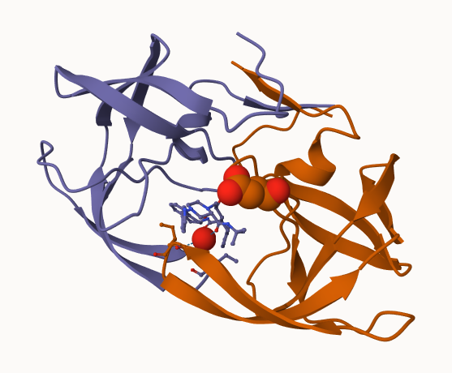

# Class 09: Structural Bioinformatics (pt. 1)
Helen Le (PID: A16300695)

# 1: Introduction to the RCSB Protein Data Bank (PDB)

First, let’s see what is in the PDC database– the main repository of
protein structures.

Downloaded composition stats from: hhtps://www.rcsb.org/stats/summary

For context: Release 2023_04 of 13-Sept-2023 of UniProt/TrEMBL contains
251600,768 sequence entries. The PDB only contains 183,201.

``` r
stats <- read.csv("PDBstats.csv", row.names=1)
stats
```

                              X.ray     EM    NMR Multiple.methods Neutron Other
    Protein (only)          158,844 11,759 12,296              197      73    32
    Protein/Oligosaccharide   9,260  2,054     34                8       1     0
    Protein/NA                8,307  3,667    284                7       0     0
    Nucleic acid (only)       2,730    113  1,467               13       3     1
    Other                       164      9     32                0       0     0
    Oligosaccharide (only)       11      0      6                1       0     4
                              Total
    Protein (only)          183,201
    Protein/Oligosaccharide  11,357
    Protein/NA               12,265
    Nucleic acid (only)       4,327
    Other                       205
    Oligosaccharide (only)       22

There’s a problem here due to the commas in the numbers. This causes R
to treat them as characters.

``` r
x <- stats$X.ray
x
```

    [1] "158,844" "9,260"   "8,307"   "2,730"   "164"     "11"     

``` r
as.numeric(gsub(",", "", x))
```

    [1] 158844   9260   8307   2730    164     11

``` r
rm.comma <- function(x) {
  as.numeric(gsub(",", "", x))
}
```

``` r
rm.comma(stats$EM)
```

    [1] 11759  2054  3667   113     9     0

I can use `apply()` to fix the whole table…

``` r
pdbstats <- apply(stats, 2, rm.comma)
rownames(pdbstats) <- rownames(stats)
head(pdbstats)
```

                             X.ray    EM   NMR Multiple.methods Neutron Other
    Protein (only)          158844 11759 12296              197      73    32
    Protein/Oligosaccharide   9260  2054    34                8       1     0
    Protein/NA                8307  3667   284                7       0     0
    Nucleic acid (only)       2730   113  1467               13       3     1
    Other                      164     9    32                0       0     0
    Oligosaccharide (only)      11     0     6                1       0     4
                             Total
    Protein (only)          183201
    Protein/Oligosaccharide  11357
    Protein/NA               12265
    Nucleic acid (only)       4327
    Other                      205
    Oligosaccharide (only)      22

Without the `row.names=1`, it would make the column values `NA`. Save
this matric to a vector & reinsert the rownames using `rownames()`.

This can also be done using the `readr` package.

**Q1: What percentage of structures in the PDB are solved by X-Ray and
Electron Microscopy.**

``` r
totals <- apply(pdbstats, 2, sum)
round(totals/totals["Total"] * 100, 2)
```

               X.ray               EM              NMR Multiple.methods 
               84.83             8.33             6.68             0.11 
             Neutron            Other            Total 
                0.04             0.02           100.00 

93.16% of structures in the PDB are solved by X-ray & EM.

**Q2: What proportion of structures in the PDB are protein?**

``` r
round(pdbstats[, "Total"]/sum(pdbstats[,"Total"]) * 100, 2)
```

             Protein (only) Protein/Oligosaccharide              Protein/NA 
                      86.67                    5.37                    5.80 
        Nucleic acid (only)                   Other  Oligosaccharide (only) 
                       2.05                    0.10                    0.01 

86.67% of thructures in the PDB are protein.

**Q3: Type HIV in the PDB website search box on the home page and
determine how many HIV-1 protease structures are in the current PDB?**
SKIPPED

# 2. Visualizing the HIV-1 protease structure

**Q4: Water molecules normally have 3 atoms. Why do we see just one atom
per water molecule in this structure?** This is a 2 Angstrom structure
and Hydrogen is not visible at this resolution. You need 1A or better to
view the entirety of the water molecule.

**Q5: There is a critical “conserved” water molecule in the binding
site. Can you identify this water molecule? What residue number does
this water molecule have?** This water molecule is water 308.

**Q6: Generate and save a figure clearly showing the two distinct chains
of HIV-protease along with the ligand. You might also consider showing
the catalytic residues ASP 25 in each chain and the critical water (we
recommend “Ball & Stick” for these side-chains). Add this figure to your
Quarto document.**

Here is a lovely figure of HIP-Pr with the catalytic ASP residues, the
MK compound and the all important water 308.



# 3. Introduction to Bio3D in R

## The bio3d package for structural bioinformatics

``` r
library(bio3d)
```

``` r
pdb <- read.pdb("1hsg")
```

      Note: Accessing on-line PDB file

``` r
pdb
```


     Call:  read.pdb(file = "1hsg")

       Total Models#: 1
         Total Atoms#: 1686,  XYZs#: 5058  Chains#: 2  (values: A B)

         Protein Atoms#: 1514  (residues/Calpha atoms#: 198)
         Nucleic acid Atoms#: 0  (residues/phosphate atoms#: 0)

         Non-protein/nucleic Atoms#: 172  (residues: 128)
         Non-protein/nucleic resid values: [ HOH (127), MK1 (1) ]

       Protein sequence:
          PQITLWQRPLVTIKIGGQLKEALLDTGADDTVLEEMSLPGRWKPKMIGGIGGFIKVRQYD
          QILIEICGHKAIGTVLVGPTPVNIIGRNLLTQIGCTLNFPQITLWQRPLVTIKIGGQLKE
          ALLDTGADDTVLEEMSLPGRWKPKMIGGIGGFIKVRQYDQILIEICGHKAIGTVLVGPTP
          VNIIGRNLLTQIGCTLNF

    + attr: atom, xyz, seqres, helix, sheet,
            calpha, remark, call

**Q7: How many amino acid residues are there in this pdb object?** There
are 198 AA residues in this pdb object.

**Q8: Name one of the two non-protein residues?** The non-protein
residues are HOH & MK1

**Q9: How many protein chains are in this structure?** There are 2
protein chains.

``` r
attributes(pdb)
```

    $names
    [1] "atom"   "xyz"    "seqres" "helix"  "sheet"  "calpha" "remark" "call"  

    $class
    [1] "pdb" "sse"

``` r
head(pdb$atom)
```

      type eleno elety  alt resid chain resno insert      x      y     z o     b
    1 ATOM     1     N <NA>   PRO     A     1   <NA> 29.361 39.686 5.862 1 38.10
    2 ATOM     2    CA <NA>   PRO     A     1   <NA> 30.307 38.663 5.319 1 40.62
    3 ATOM     3     C <NA>   PRO     A     1   <NA> 29.760 38.071 4.022 1 42.64
    4 ATOM     4     O <NA>   PRO     A     1   <NA> 28.600 38.302 3.676 1 43.40
    5 ATOM     5    CB <NA>   PRO     A     1   <NA> 30.508 37.541 6.342 1 37.87
    6 ATOM     6    CG <NA>   PRO     A     1   <NA> 29.296 37.591 7.162 1 38.40
      segid elesy charge
    1  <NA>     N   <NA>
    2  <NA>     C   <NA>
    3  <NA>     C   <NA>
    4  <NA>     O   <NA>
    5  <NA>     C   <NA>
    6  <NA>     C   <NA>

# Predicting functional motions of a single structure

Let’s finish today with a bioinformatics calculation to predict the
functional motions of a PDB structure.

``` r
adk <- read.pdb("6s36")
```

      Note: Accessing on-line PDB file
       PDB has ALT records, taking A only, rm.alt=TRUE

``` r
# Perform flexiblity prediction
m <- nma(adk)
```

     Building Hessian...        Done in 0.01 seconds.
     Diagonalizing Hessian...   Done in 0.42 seconds.

``` r
plot(m)
```


``` r
mktrj(m, file="adk_m7.pdb")
```
