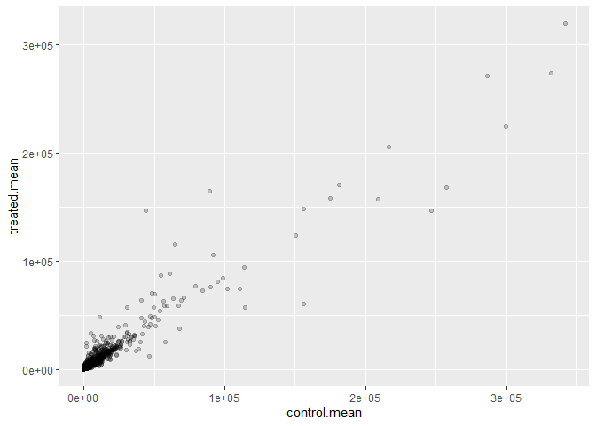

# Class 13: Transcriptomics and the analysis of RNA-Seq data
Helen Le (PID: A16300695)

# 3. Import countData and colData

The data for this hands-on session comes from a published RNA-sez
experiement where airway smooth muscle cells were treated with
**dexamethasone** (dex)

``` r
counts <- read.csv("airway_scaledcounts.csv", row.names=1)
metadata <-  read.csv("airway_metadata.csv")
```

``` r
head(counts)
```

                    SRR1039508 SRR1039509 SRR1039512 SRR1039513 SRR1039516
    ENSG00000000003        723        486        904        445       1170
    ENSG00000000005          0          0          0          0          0
    ENSG00000000419        467        523        616        371        582
    ENSG00000000457        347        258        364        237        318
    ENSG00000000460         96         81         73         66        118
    ENSG00000000938          0          0          1          0          2
                    SRR1039517 SRR1039520 SRR1039521
    ENSG00000000003       1097        806        604
    ENSG00000000005          0          0          0
    ENSG00000000419        781        417        509
    ENSG00000000457        447        330        324
    ENSG00000000460         94        102         74
    ENSG00000000938          0          0          0

``` r
head(metadata)
```

              id     dex celltype     geo_id
    1 SRR1039508 control   N61311 GSM1275862
    2 SRR1039509 treated   N61311 GSM1275863
    3 SRR1039512 control  N052611 GSM1275866
    4 SRR1039513 treated  N052611 GSM1275867
    5 SRR1039516 control  N080611 GSM1275870
    6 SRR1039517 treated  N080611 GSM1275871

**Q1. How many genes are in this dataset?**

``` r
dim(counts)
```

    [1] 38694     8

There are 38694 genes in this dataset.

**Q2. How many ‘control’ cell lines do we have?**

``` r
sum(metadata$dex == "control")
```

    [1] 4

There are 4 ‘control’ cell lines in this data set.

# 4. Toy differential gene expression

Let’s calculate the mean counts per gene (from the metadata) in the
“control” samples. We can use this to compare the value for each gene to
the mean counts in the “treated” samples.

**Q3. How would you make the above code in either approach more robust?
Is there a function that could help here?** rowSums could help here.

- Step 1. Find which columns in `counts` correspond to “control”
  samples.

``` r
head(counts)
```

                    SRR1039508 SRR1039509 SRR1039512 SRR1039513 SRR1039516
    ENSG00000000003        723        486        904        445       1170
    ENSG00000000005          0          0          0          0          0
    ENSG00000000419        467        523        616        371        582
    ENSG00000000457        347        258        364        237        318
    ENSG00000000460         96         81         73         66        118
    ENSG00000000938          0          0          1          0          2
                    SRR1039517 SRR1039520 SRR1039521
    ENSG00000000003       1097        806        604
    ENSG00000000005          0          0          0
    ENSG00000000419        781        417        509
    ENSG00000000457        447        330        324
    ENSG00000000460         94        102         74
    ENSG00000000938          0          0          0

``` r
control.inds <- metadata$dex == "control"
metadata[control.inds,]
```

              id     dex celltype     geo_id
    1 SRR1039508 control   N61311 GSM1275862
    3 SRR1039512 control  N052611 GSM1275866
    5 SRR1039516 control  N080611 GSM1275870
    7 SRR1039520 control  N061011 GSM1275874

``` r
control.counts <- counts[,control.inds]
head(control.counts)
```

                    SRR1039508 SRR1039512 SRR1039516 SRR1039520
    ENSG00000000003        723        904       1170        806
    ENSG00000000005          0          0          0          0
    ENSG00000000419        467        616        582        417
    ENSG00000000457        347        364        318        330
    ENSG00000000460         96         73        118        102
    ENSG00000000938          0          1          2          0

- Step 2. Calculate the mean value per gene in these columns.
- Step 3. Store this as a vector for later use (labeled `control.mean`)

``` r
# apply(control.counts, 1, mean)
control.mean <- rowMeans(control.counts)
```

**Q4. Follow the same procedure for the treated samples (i.e. calculate
the mean per gene across drug treated samples and assign to a labeled
vector called treated.mean)** For the treated samples: - Step 1.

``` r
treated.inds <- metadata$dex == "treated"
metadata[treated.inds,]
```

              id     dex celltype     geo_id
    2 SRR1039509 treated   N61311 GSM1275863
    4 SRR1039513 treated  N052611 GSM1275867
    6 SRR1039517 treated  N080611 GSM1275871
    8 SRR1039521 treated  N061011 GSM1275875

``` r
treated.counts <- counts[,treated.inds]
head(treated.counts)
```

                    SRR1039509 SRR1039513 SRR1039517 SRR1039521
    ENSG00000000003        486        445       1097        604
    ENSG00000000005          0          0          0          0
    ENSG00000000419        523        371        781        509
    ENSG00000000457        258        237        447        324
    ENSG00000000460         81         66         94         74
    ENSG00000000938          0          0          0          0

- Step 2 & 3.

``` r
treated.mean <- rowMeans(treated.counts)
```

Or, a shorter way to write this is:

``` r
treated.mean <- rowMeans( counts[, metadata$dex == "treated"])
```

To keep this tidy, let’s put `control.mean` and `treated.mean` vectors
together as two columns of a new data frame.

``` r
meancounts <- data.frame(control.mean, treated.mean)
```

``` r
head(meancounts)
```

                    control.mean treated.mean
    ENSG00000000003       900.75       658.00
    ENSG00000000005         0.00         0.00
    ENSG00000000419       520.50       546.00
    ENSG00000000457       339.75       316.50
    ENSG00000000460        97.25        78.75
    ENSG00000000938         0.75         0.00

**Q5 (a). Create a scatter plot showing the mean of the treated samples
against the mean of the control samples.**

``` r
plot(meancounts)
```


**Q5 (b).You could also use the ggplot2 package to make this figure
producing the plot below. What geom\_?() function would you use for this
plot?** The geom_point() function would be used for this plot.

Let’s plot this using ggplot:

``` r
library(ggplot2)
```

``` r
ggplot(meancounts) +
  aes(control.mean, treated.mean) +
  # Make the points transparent since so many sample points are overlapping
  geom_point(alpha=0.2)
```



**Q6. Try plotting both axes on a log scale. What is the argument to
plot() that allows you to do this?** The `log=""` argument allows this
to be done in plot().

``` r
plot(meancounts, log="xy")
```

    Warning in xy.coords(x, y, xlabel, ylabel, log): 15032 x values <= 0 omitted
    from logarithmic plot

    Warning in xy.coords(x, y, xlabel, ylabel, log): 15281 y values <= 0 omitted
    from logarithmic plot


For ggplot, this can be done with `scale_x_continuous(trans="log2")` and
`scale_y_continuous(trans="log2")`.

``` r
ggplot(meancounts) +
  aes(control.mean, treated.mean) +
  geom_point(alpha=0.2) +
  scale_x_continuous(trans="log2") +
  scale_y_continuous(trans="log2")
```

    Warning: Transformation introduced infinite values in continuous x-axis

    Warning: Transformation introduced infinite values in continuous y-axis


Log transformations are super useful when our data is skewed and
measured over a wide range like this. We can use different log
transformations like base10 or natural logs but we most often prefer
log2 units. - Makes the math and interpretation much easier.

``` r
# Control/Treated
log2(10/10)
```

    [1] 0

What if there was a doubling?

``` r
# Treated/control
log2(20/10)
```

    [1] 1

Half counts

``` r
log2(10/20)
```

    [1] -1

``` r
log2(40/10)
```

    [1] 2

vs.

``` r
log10(40/10)
```

    [1] 0.60206

Let’s add a log2 fold-change column to our `meancounts` data.frame.

``` r
meancounts$log2fc <- log2(meancounts$treated.mean/meancounts$control.mean)

head(meancounts)
```

                    control.mean treated.mean      log2fc
    ENSG00000000003       900.75       658.00 -0.45303916
    ENSG00000000005         0.00         0.00         NaN
    ENSG00000000419       520.50       546.00  0.06900279
    ENSG00000000457       339.75       316.50 -0.10226805
    ENSG00000000460        97.25        78.75 -0.30441833
    ENSG00000000938         0.75         0.00        -Inf

There are some odd results. Let’s remove these genes.

``` r
to.rm.inds <- rowSums(meancounts[,1:2] == 0) > 0
mycounts <- meancounts[!to.rm.inds,]
```

The `!` mark lips TRUE values to FALSE and vice-versa…

``` r
dim(mycounts)
```

    [1] 21817     3

``` r
head(mycounts)
```

                    control.mean treated.mean      log2fc
    ENSG00000000003       900.75       658.00 -0.45303916
    ENSG00000000419       520.50       546.00  0.06900279
    ENSG00000000457       339.75       316.50 -0.10226805
    ENSG00000000460        97.25        78.75 -0.30441833
    ENSG00000000971      5219.00      6687.50  0.35769358
    ENSG00000001036      2327.00      1785.75 -0.38194109

In the lab sheet, the following code is used:

``` r
zero.vals <- which(meancounts[,1:2]==0, arr.ind=TRUE)

to.rm <- unique(zero.vals[,1])
mycounts <- meancounts[-to.rm,]
head(mycounts)
```

                    control.mean treated.mean      log2fc
    ENSG00000000003       900.75       658.00 -0.45303916
    ENSG00000000419       520.50       546.00  0.06900279
    ENSG00000000457       339.75       316.50 -0.10226805
    ENSG00000000460        97.25        78.75 -0.30441833
    ENSG00000000971      5219.00      6687.50  0.35769358
    ENSG00000001036      2327.00      1785.75 -0.38194109

**Q7. What is the purpose of the arr.ind argument in the which()
function call above? Why would we then take the first column of the
output and need to call the unique() function?** The arr.ind argument in
the `which()` function returns both the column and row indices where
there are `TRUE` values.

A common threshold used for calling something differentially expressed
is a log2(FoldChange) of greater than 2 or less than -2.

Let’s filter the dataset both ways to see how many genes are up or
down-regulated.

``` r
up.ind <- mycounts$log2fc > 2
down.ind <- mycounts$log2fc < (-2)
```

**Q8. Using the up.ind vector above can you determine how many up
regulated genes we have at the greater than 2 fc level?**

``` r
sum(up.ind)
```

    [1] 250

There are 250 up-regulated genes at the greater than 2 fc level.

**Q9. Using the down.ind vector above can you determine how many down
regulated genes we have at the greater than 2 fc level?**

``` r
sum(down.ind)
```

    [1] 367

There are 367 down-regulated genes at the lower than -2 fc level.

**Q10. Do you trust these results? Why or why not?** No; We haven’t
considered statistical significance (i.e., p-value), so it is currently
hard to determine if the differences in the data are significant.
Without statistical significance in mind, these results can be
misleading.

But, we forgot all about statistical significance of these differences…

We will use the DESeq2 package to do this analysis properly…

# Using DESeq2

Like any package, we must load it up with a `library()` call.

``` r
library(DESeq2)
```

    Loading required package: S4Vectors

    Loading required package: stats4

    Loading required package: BiocGenerics


    Attaching package: 'BiocGenerics'

    The following objects are masked from 'package:stats':

        IQR, mad, sd, var, xtabs

    The following objects are masked from 'package:base':

        anyDuplicated, aperm, append, as.data.frame, basename, cbind,
        colnames, dirname, do.call, duplicated, eval, evalq, Filter, Find,
        get, grep, grepl, intersect, is.unsorted, lapply, Map, mapply,
        match, mget, order, paste, pmax, pmax.int, pmin, pmin.int,
        Position, rank, rbind, Reduce, rownames, sapply, setdiff, sort,
        table, tapply, union, unique, unsplit, which.max, which.min


    Attaching package: 'S4Vectors'

    The following object is masked from 'package:utils':

        findMatches

    The following objects are masked from 'package:base':

        expand.grid, I, unname

    Loading required package: IRanges


    Attaching package: 'IRanges'

    The following object is masked from 'package:grDevices':

        windows

    Loading required package: GenomicRanges

    Loading required package: GenomeInfoDb

    Loading required package: SummarizedExperiment

    Loading required package: MatrixGenerics

    Loading required package: matrixStats

    Warning: package 'matrixStats' was built under R version 4.3.2


    Attaching package: 'MatrixGenerics'

    The following objects are masked from 'package:matrixStats':

        colAlls, colAnyNAs, colAnys, colAvgsPerRowSet, colCollapse,
        colCounts, colCummaxs, colCummins, colCumprods, colCumsums,
        colDiffs, colIQRDiffs, colIQRs, colLogSumExps, colMadDiffs,
        colMads, colMaxs, colMeans2, colMedians, colMins, colOrderStats,
        colProds, colQuantiles, colRanges, colRanks, colSdDiffs, colSds,
        colSums2, colTabulates, colVarDiffs, colVars, colWeightedMads,
        colWeightedMeans, colWeightedMedians, colWeightedSds,
        colWeightedVars, rowAlls, rowAnyNAs, rowAnys, rowAvgsPerColSet,
        rowCollapse, rowCounts, rowCummaxs, rowCummins, rowCumprods,
        rowCumsums, rowDiffs, rowIQRDiffs, rowIQRs, rowLogSumExps,
        rowMadDiffs, rowMads, rowMaxs, rowMeans2, rowMedians, rowMins,
        rowOrderStats, rowProds, rowQuantiles, rowRanges, rowRanks,
        rowSdDiffs, rowSds, rowSums2, rowTabulates, rowVarDiffs, rowVars,
        rowWeightedMads, rowWeightedMeans, rowWeightedMedians,
        rowWeightedSds, rowWeightedVars

    Loading required package: Biobase

    Welcome to Bioconductor

        Vignettes contain introductory material; view with
        'browseVignettes()'. To cite Bioconductor, see
        'citation("Biobase")', and for packages 'citation("pkgname")'.


    Attaching package: 'Biobase'

    The following object is masked from 'package:MatrixGenerics':

        rowMedians

    The following objects are masked from 'package:matrixStats':

        anyMissing, rowMedians

Setup the input object required by DESeq:

``` r
dds <- DESeqDataSetFromMatrix(countData= counts, 
                       colData= metadata, 
                       design = ~dex)
```

    converting counts to integer mode

    Warning in DESeqDataSet(se, design = design, ignoreRank): some variables in
    design formula are characters, converting to factors

Now we can run our DESeq analysis:

``` r
dds <- DESeq(dds)
```

    estimating size factors

    estimating dispersions

    gene-wise dispersion estimates

    mean-dispersion relationship

    final dispersion estimates

    fitting model and testing

Get our results back from the `dds` object:

``` r
res <- results(dds)
head(res)
```

    log2 fold change (MLE): dex treated vs control 
    Wald test p-value: dex treated vs control 
    DataFrame with 6 rows and 6 columns
                      baseMean log2FoldChange     lfcSE      stat    pvalue
                     <numeric>      <numeric> <numeric> <numeric> <numeric>
    ENSG00000000003 747.194195     -0.3507030  0.168246 -2.084470 0.0371175
    ENSG00000000005   0.000000             NA        NA        NA        NA
    ENSG00000000419 520.134160      0.2061078  0.101059  2.039475 0.0414026
    ENSG00000000457 322.664844      0.0245269  0.145145  0.168982 0.8658106
    ENSG00000000460  87.682625     -0.1471420  0.257007 -0.572521 0.5669691
    ENSG00000000938   0.319167     -1.7322890  3.493601 -0.495846 0.6200029
                         padj
                    <numeric>
    ENSG00000000003  0.163035
    ENSG00000000005        NA
    ENSG00000000419  0.176032
    ENSG00000000457  0.961694
    ENSG00000000460  0.815849
    ENSG00000000938        NA

# A summary results plot

Volcano plot. This is a common type of summary figure that keeps both
our inner biologist and inner nerd happy because it shows both P-values
and log2(Fold-Changes).

``` r
plot(res$log2FoldChange, -log(res$padj))
abline(v=2, col="red")
abline(v=-2, col="red")
abline(h=-log(0.05), col="blue")
```


``` r
log(0.1)
```

    [1] -2.302585

``` r
log(0.00001)
```

    [1] -11.51293

We did `-log()` since we care about the results with low adjusted
p-values. - this removes large values we don’t care about and flips the
plot for better legibility.

Let’s make a prettier plot using ggplot:

``` r
# Let's setup our custom point color vector 
mycols <- rep("gray", nrow(res))
mycols[abs(res$log2FoldChange) > 2]  <- "red" 
inds <- (res$padj < 0.01) & (abs(res$log2FoldChange) > 2 )
mycols[inds] <- "blue"

# Create a data frame to use for ggplot
res_df <- data.frame(res$log2FoldChange, res$padj)

ggplot(res_df) +
  aes(res$log2FoldChange, -log(res$padj)) +
  geom_point(alpha=0.5, col=mycols) +
  labs(y="-Log(P-value)", x="Log2(FoldChange)") +
  geom_vline(xintercept=c(-2,2), col="red") +
  geom_hline(yintercept=-log(0.5), col="blue")
```

    Warning: Removed 23549 rows containing missing values (`geom_point()`).


Save our results to date…

``` r
write.csv(res, file="deseq_results.csv")
```

# 8. Adding annotation data

``` r
library("AnnotationDbi")
```

    Warning: package 'AnnotationDbi' was built under R version 4.3.2

``` r
library("org.Hs.eg.db")
```

``` r
columns(org.Hs.eg.db)
```

     [1] "ACCNUM"       "ALIAS"        "ENSEMBL"      "ENSEMBLPROT"  "ENSEMBLTRANS"
     [6] "ENTREZID"     "ENZYME"       "EVIDENCE"     "EVIDENCEALL"  "GENENAME"    
    [11] "GENETYPE"     "GO"           "GOALL"        "IPI"          "MAP"         
    [16] "OMIM"         "ONTOLOGY"     "ONTOLOGYALL"  "PATH"         "PFAM"        
    [21] "PMID"         "PROSITE"      "REFSEQ"       "SYMBOL"       "UCSCKG"      
    [26] "UNIPROT"     

The main function we will use here is called `mapIds()`.

Our current IDs are here:

``` r
head(row.names(res))
```

    [1] "ENSG00000000003" "ENSG00000000005" "ENSG00000000419" "ENSG00000000457"
    [5] "ENSG00000000460" "ENSG00000000938"

These are in ENSEMBL format. I want “SYMBOL” ids:

``` r
res$symbol <- mapIds(org.Hs.eg.db,
                     keys=row.names(res), # Our genenames
                     keytype="ENSEMBL",   # The format of our genenames
                     column="SYMBOL",     # The new format we want to add
                     multiVals="first")
```

    'select()' returned 1:many mapping between keys and columns

``` r
head(res)
```

    log2 fold change (MLE): dex treated vs control 
    Wald test p-value: dex treated vs control 
    DataFrame with 6 rows and 7 columns
                      baseMean log2FoldChange     lfcSE      stat    pvalue
                     <numeric>      <numeric> <numeric> <numeric> <numeric>
    ENSG00000000003 747.194195     -0.3507030  0.168246 -2.084470 0.0371175
    ENSG00000000005   0.000000             NA        NA        NA        NA
    ENSG00000000419 520.134160      0.2061078  0.101059  2.039475 0.0414026
    ENSG00000000457 322.664844      0.0245269  0.145145  0.168982 0.8658106
    ENSG00000000460  87.682625     -0.1471420  0.257007 -0.572521 0.5669691
    ENSG00000000938   0.319167     -1.7322890  3.493601 -0.495846 0.6200029
                         padj      symbol
                    <numeric> <character>
    ENSG00000000003  0.163035      TSPAN6
    ENSG00000000005        NA        TNMD
    ENSG00000000419  0.176032        DPM1
    ENSG00000000457  0.961694       SCYL3
    ENSG00000000460  0.815849       FIRRM
    ENSG00000000938        NA         FGR

Let’s add GENENAME

``` r
res$genename <- mapIds(org.Hs.eg.db,
                     keys=row.names(res), 
                     keytype="ENSEMBL",       
                     column="GENENAME",      
                     multiVals="first")
```

    'select()' returned 1:many mapping between keys and columns

``` r
head(res)
```

    log2 fold change (MLE): dex treated vs control 
    Wald test p-value: dex treated vs control 
    DataFrame with 6 rows and 8 columns
                      baseMean log2FoldChange     lfcSE      stat    pvalue
                     <numeric>      <numeric> <numeric> <numeric> <numeric>
    ENSG00000000003 747.194195     -0.3507030  0.168246 -2.084470 0.0371175
    ENSG00000000005   0.000000             NA        NA        NA        NA
    ENSG00000000419 520.134160      0.2061078  0.101059  2.039475 0.0414026
    ENSG00000000457 322.664844      0.0245269  0.145145  0.168982 0.8658106
    ENSG00000000460  87.682625     -0.1471420  0.257007 -0.572521 0.5669691
    ENSG00000000938   0.319167     -1.7322890  3.493601 -0.495846 0.6200029
                         padj      symbol               genename
                    <numeric> <character>            <character>
    ENSG00000000003  0.163035      TSPAN6          tetraspanin 6
    ENSG00000000005        NA        TNMD            tenomodulin
    ENSG00000000419  0.176032        DPM1 dolichyl-phosphate m..
    ENSG00000000457  0.961694       SCYL3 SCY1 like pseudokina..
    ENSG00000000460  0.815849       FIRRM FIGNL1 interacting r..
    ENSG00000000938        NA         FGR FGR proto-oncogene, ..

``` r
res$entrez <- mapIds(org.Hs.eg.db,
                     keys=row.names(res), 
                     keytype="ENSEMBL", 
                     column="ENTREZID",  
                     multiVals="first")
```

    'select()' returned 1:many mapping between keys and columns

## Pathway analysis

We will use the **gage** package along with **pathview** here to do
geneset enrichment (a.k.a. pathway analysis) and figure generation
respectively.

``` r
#/ message: false
library(pathview)
```

    ##############################################################################
    Pathview is an open source software package distributed under GNU General
    Public License version 3 (GPLv3). Details of GPLv3 is available at
    http://www.gnu.org/licenses/gpl-3.0.html. Particullary, users are required to
    formally cite the original Pathview paper (not just mention it) in publications
    or products. For details, do citation("pathview") within R.

    The pathview downloads and uses KEGG data. Non-academic uses may require a KEGG
    license agreement (details at http://www.kegg.jp/kegg/legal.html).
    ##############################################################################

``` r
library(gage)
```

``` r
library(gageData)
```

Let’s have a peek at the first two pathways in KEGG:

``` r
data(kegg.sets.hs)

# Examine the first 2 pathways in this kegg set for humans
head(kegg.sets.hs, 2) 
```

    $`hsa00232 Caffeine metabolism`
    [1] "10"   "1544" "1548" "1549" "1553" "7498" "9"   

    $`hsa00983 Drug metabolism - other enzymes`
     [1] "10"     "1066"   "10720"  "10941"  "151531" "1548"   "1549"   "1551"  
     [9] "1553"   "1576"   "1577"   "1806"   "1807"   "1890"   "221223" "2990"  
    [17] "3251"   "3614"   "3615"   "3704"   "51733"  "54490"  "54575"  "54576" 
    [25] "54577"  "54578"  "54579"  "54600"  "54657"  "54658"  "54659"  "54963" 
    [33] "574537" "64816"  "7083"   "7084"   "7172"   "7363"   "7364"   "7365"  
    [41] "7366"   "7367"   "7371"   "7372"   "7378"   "7498"   "79799"  "83549" 
    [49] "8824"   "8833"   "9"      "978"   

What we need for `gage()` is our genes in ENTREZ id format with a
measure of their importance.

It wants a vector of e.g. fold-changes.

``` r
foldchanges <- res$log2FoldChange
head(foldchanges)
```

    [1] -0.35070302          NA  0.20610777  0.02452695 -0.14714205 -1.73228897

Add ENTREZ ids as `names()` to my `foldchanges` vector.

``` r
names(foldchanges) <- res$entrez
head(foldchanges)
```

           7105       64102        8813       57147       55732        2268 
    -0.35070302          NA  0.20610777  0.02452695 -0.14714205 -1.73228897 

``` r
keggres <- gage(foldchanges, gsets=kegg.sets.hs)
```

Look at the results

``` r
attributes(keggres)
```

    $names
    [1] "greater" "less"    "stats"  

``` r
# Look at the first three down (less) pathways
head(keggres$less, 3)
```

                                          p.geomean stat.mean        p.val
    hsa05332 Graft-versus-host disease 0.0004250461 -3.473346 0.0004250461
    hsa04940 Type I diabetes mellitus  0.0017820293 -3.002352 0.0017820293
    hsa05310 Asthma                    0.0020045888 -3.009050 0.0020045888
                                            q.val set.size         exp1
    hsa05332 Graft-versus-host disease 0.09053483       40 0.0004250461
    hsa04940 Type I diabetes mellitus  0.14232581       42 0.0017820293
    hsa05310 Asthma                    0.14232581       29 0.0020045888

We can view these pathways with our geneset genes highlighted using the
`pathview()` function. E.g. for “Asthma” I will use the pathway.id
hsa05310 as seen above.

``` r
pathview(gene.data=foldchanges, pathway.id="hsa05310")
```

    'select()' returned 1:1 mapping between keys and columns

    Info: Working in directory C:/Users/helxn/OneDrive/Documents/School/BIMM143/bimm143_github/class13

    Info: Writing image file hsa05310.pathview.png


