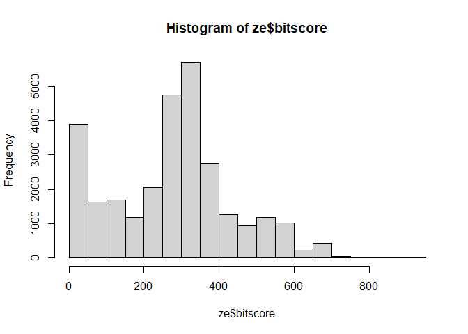

# Class 17: Essential UNIX for Bioinformatics
Helen Le (PID: A16300695)

``` r
ze <- read.delim("mm-second.x.zebrafish.tsv")

colnames(ze) <- c("qseqid", "sseqid", "pident", "length", "mismatch", "gapopen", "qstart", "qend", "sstart", "send", "evalue", "bitscore")

head(ze)
```

           qseqid         sseqid pident length mismatch gapopen qstart qend sstart
    1 NP_598866.1 NP_001313634.1 46.154    273      130       6      4  267    476
    2 NP_598866.1 XP_009294513.1 46.154    273      130       6      4  267    475
    3 NP_598866.1 NP_001186666.1 33.071    127       76       5      4  126    338
    4 NP_598866.1 NP_001003517.1 30.400    125       82       4      4  126    344
    5 NP_598866.1 NP_001003517.1 30.645     62       41       2     53  113     43
    6 NP_598866.1    NP_956073.2 34.444     90       56       3     40  126    527
      send   evalue bitscore
    1  740 4.51e-63    214.0
    2  739 4.69e-63    214.0
    3  459 5.19e-12     67.8
    4  465 2.67e-11     65.5
    5  103 4.40e-01     33.9
    6  616 1.70e-10     63.2

Let’s make a histogram of `$bitscore` values.

``` r
hist(ze$bitscore, breaks=30)
```



``` r
hist(ze$pident, breaks=30)
```


Bitscores are only somewhat related to pident; they take into account
not only the percent identity but the length of the alignment. You can
get a napkin sketch estimate of this by doing the following:

``` r
## Asuming your blast results are stored in an object called 'ze'
plot(ze$pident  * (ze$qend - ze$qstart), ze$bitscore)
```


Let’s use ggplot instead.

``` r
library(ggplot2)

ggplot(ze, aes(pident, bitscore)) +
  geom_point(alpha=0.1)
```


``` r
ggplot(ze, aes((ze$pident * (ze$qend - ze$qstart)), bitscore)) +
  geom_point(alpha=0.1) +
  geom_smooth()
```

    Warning: Use of `ze$pident` is discouraged.
    ℹ Use `pident` instead.

    Warning: Use of `ze$qend` is discouraged.
    ℹ Use `qend` instead.

    Warning: Use of `ze$qstart` is discouraged.
    ℹ Use `qstart` instead.

    Warning: Use of `ze$pident` is discouraged.
    ℹ Use `pident` instead.

    Warning: Use of `ze$qend` is discouraged.
    ℹ Use `qend` instead.

    Warning: Use of `ze$qstart` is discouraged.
    ℹ Use `qstart` instead.

    `geom_smooth()` using method = 'gam' and formula = 'y ~ s(x, bs = "cs")'


