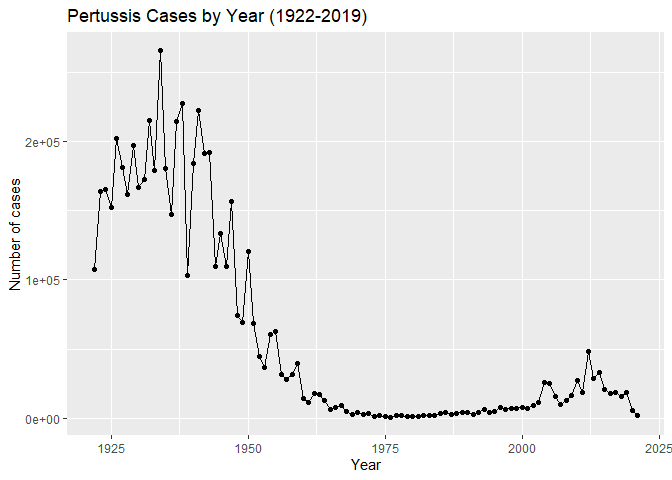
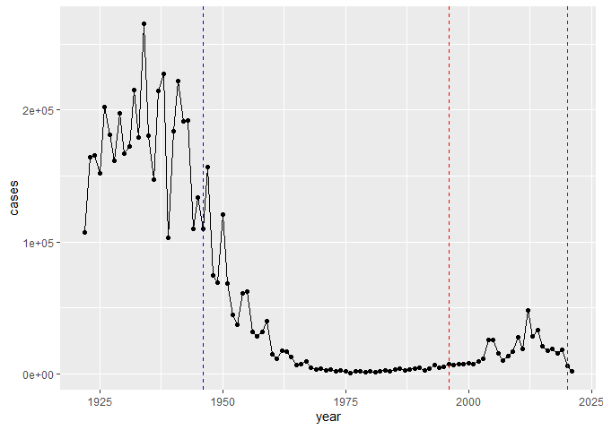
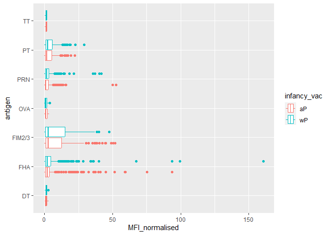
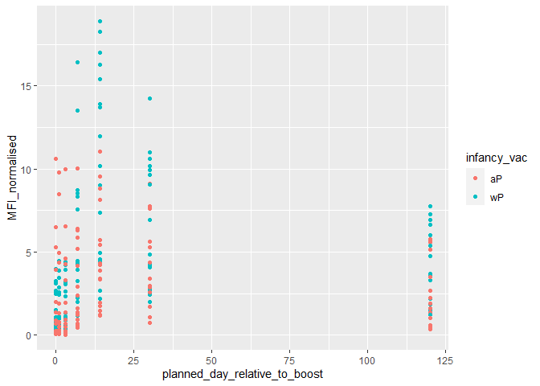

# Class 19: Pertussis and the CMI-PB project
Heln Le (PID: A16300695)

Pertussis is a severe lung infection, also known as whooping cough.

We will begin by investigating the number of Pertussis cases per year in
the US.

This data is available on the CDC website
[here](https://www.cdc.gov/pertussis/surv-reporting/cases-by-year.html)

## Q1. With the help of the R “addin” package datapasta assign the CDC pertussis case number data to a data frame called cdc and use ggplot to make a plot of cases numbers over time.

Let’s have a little look at the data frame.

``` r
head(cdc)
```

      year  cases
    1 1922 107473
    2 1923 164191
    3 1924 165418
    4 1925 152003
    5 1926 202210
    6 1927 181411

``` r
library(ggplot2)
```

``` r
ggplot(cdc) +
  aes(year, cases) +
  geom_point() +
  geom_line() +
  labs(title = "Pertussis Cases by Year (1922-2019)",
       x = "Year",
       y = "Number of cases")
```



## Q2. Using the ggplot geom_vline() function add lines to your previous plot for the 1946 introduction of the wP vaccine and the 1996 switch to aP vaccine (see example in the hint below). What do you notice?

``` r
ggplot(cdc) +
  aes(year, cases) +
  geom_point() +
  geom_line() +
  geom_vline(xintercept = 1946, linetype = "dashed", col="blue") +
  geom_vline(xintercept = 1996, linetype = "dashed", col="red") +
  geom_vline(xintercept = 2020, linetype = "dashed", col="darkgreen")
```



## Q3. Describe what happened after the introduction of the aP vaccine? Do you have a possible explanation for the observed trend?

There is a lag and then cases rise with a ~3 year cycle perhaps similar
to that observed before to the first wP vaccine introduction.

# 3. Exploring CMI-PB data

Why is this vaccine-preventable disease on the upswing? To answer this
question we need to investigate the mechanisms underlying waning
protection against pertussis. This requires evaluation of
pertussis-specific immune responses over time in wP and aP vaccinated
individuals.

This is the goals of the CMI-PB project: https://www.cmi-pb.org/

The CMI-PB project makes its data available via “API-endpoint” that
returns JSON format.

We will use the **jsonlite** package to access this data. The main
function in this package is called `read_json()`.

``` r
library(jsonlite)
```

    Warning: package 'jsonlite' was built under R version 4.3.2

``` r
# Subject table
subject <- read_json("http://cmi-pb.org/api/subject", simplifyVector = TRUE)
specimen <- read_json("http://cmi-pb.org/api/specimen", simplifyVector = TRUE)
titer <- read_json("http://cmi-pb.org/api/v4/plasma_ab_titer", simplifyVector = TRUE)
```

Let’s have a look at these new objects:

``` r
head(subject)
```

      subject_id infancy_vac biological_sex              ethnicity  race
    1          1          wP         Female Not Hispanic or Latino White
    2          2          wP         Female Not Hispanic or Latino White
    3          3          wP         Female                Unknown White
    4          4          wP           Male Not Hispanic or Latino Asian
    5          5          wP           Male Not Hispanic or Latino Asian
    6          6          wP         Female Not Hispanic or Latino White
      year_of_birth date_of_boost      dataset
    1    1986-01-01    2016-09-12 2020_dataset
    2    1968-01-01    2019-01-28 2020_dataset
    3    1983-01-01    2016-10-10 2020_dataset
    4    1988-01-01    2016-08-29 2020_dataset
    5    1991-01-01    2016-08-29 2020_dataset
    6    1988-01-01    2016-10-10 2020_dataset

``` r
head(titer)
```

      specimen_id isotype is_antigen_specific antigen        MFI MFI_normalised
    1           1     IgE               FALSE   Total 1110.21154       2.493425
    2           1     IgE               FALSE   Total 2708.91616       2.493425
    3           1     IgG                TRUE      PT   68.56614       3.736992
    4           1     IgG                TRUE     PRN  332.12718       2.602350
    5           1     IgG                TRUE     FHA 1887.12263      34.050956
    6           1     IgE                TRUE     ACT    0.10000       1.000000
       unit lower_limit_of_detection
    1 UG/ML                 2.096133
    2 IU/ML                29.170000
    3 IU/ML                 0.530000
    4 IU/ML                 6.205949
    5 IU/ML                 4.679535
    6 IU/ML                 2.816431

## Q4. How many aP and wP infancy vaccinated subjects are in the dataset?

``` r
table(subject$infancy_vac)
```


    aP wP 
    60 58 

There are 60 aP and 58 wP infancy vaccinated subjects in the dataset.

## Q5. How many Male and Female subjects/patients are in the dataset?

``` r
table(subject$biological_sex)
```


    Female   Male 
        79     39 

There are 79 Female and 39 Male subjects in the dataset.

## Q6. What is the breakdown of race and biological sex (e.g. number of Asian females, White males etc…)?

``` r
table(subject$race, subject$biological_sex)
```

                                               
                                                Female Male
      American Indian/Alaska Native                  0    1
      Asian                                         21   11
      Black or African American                      2    0
      More Than One Race                             9    2
      Native Hawaiian or Other Pacific Islander      1    1
      Unknown or Not Reported                       11    4
      White                                         35   20

The breakdown of race and biological sex is listed above.The most
represented category in this dataset is White female subjects.

This data is not the most representative of the true population as the
data was taken during the pandemic, making many reluctant to come in for
data collection.

``` r
library(tidyverse)
```

    Warning: package 'tidyverse' was built under R version 4.3.2

    Warning: package 'readr' was built under R version 4.3.2

    Warning: package 'forcats' was built under R version 4.3.2

    Warning: package 'lubridate' was built under R version 4.3.2

    ── Attaching core tidyverse packages ──────────────────────── tidyverse 2.0.0 ──
    ✔ dplyr     1.1.3     ✔ readr     2.1.4
    ✔ forcats   1.0.0     ✔ stringr   1.5.0
    ✔ lubridate 1.9.3     ✔ tibble    3.2.1
    ✔ purrr     1.0.2     ✔ tidyr     1.3.0
    ── Conflicts ────────────────────────────────────────── tidyverse_conflicts() ──
    ✖ dplyr::filter()  masks stats::filter()
    ✖ purrr::flatten() masks jsonlite::flatten()
    ✖ dplyr::lag()     masks stats::lag()
    ℹ Use the conflicted package (<http://conflicted.r-lib.org/>) to force all conflicts to become errors

``` r
today()
```

    [1] "2023-12-07"

``` r
today() - mdy("11-28-2001")
```

    Time difference of 8044 days

``` r
time_length(today() - ymd("2002-1-17"), "years")
```

    [1] 21.88638

## Q7. Using this approach determine (i) the average age of wP individuals, (ii) the average age of aP individuals; and (iii) are they significantly different?

``` r
# Use todays date to calculate age in days
subject$age <- today() - ymd(subject$year_of_birth)
```

``` r
library(dplyr)

# aP
ap <- subject %>% filter(infancy_vac == "aP")

round( summary( time_length( ap$age, "years" ) ) )
```

       Min. 1st Qu.  Median    Mean 3rd Qu.    Max. 
         21      26      26      26      27      30 

The average age of aP individuals is 26 years old.

``` r
# wP
wp <- subject %>% filter(infancy_vac == "wP")
round( summary( time_length( wp$age, "years" ) ) )
```

       Min. 1st Qu.  Median    Mean 3rd Qu.    Max. 
         28      31      35      36      39      56 

The average age of wP individuals is 36 years old.

## Q8. Determine the age of all individuals at time of boost?

``` r
subject$age <- ymd(subject$date_of_boost) - ymd(subject$year_of_birth)

subject$age_years <- time_length(subject$age, "years")

head(subject)
```

      subject_id infancy_vac biological_sex              ethnicity  race
    1          1          wP         Female Not Hispanic or Latino White
    2          2          wP         Female Not Hispanic or Latino White
    3          3          wP         Female                Unknown White
    4          4          wP           Male Not Hispanic or Latino Asian
    5          5          wP           Male Not Hispanic or Latino Asian
    6          6          wP         Female Not Hispanic or Latino White
      year_of_birth date_of_boost      dataset        age age_years
    1    1986-01-01    2016-09-12 2020_dataset 11212 days  30.69678
    2    1968-01-01    2019-01-28 2020_dataset 18655 days  51.07461
    3    1983-01-01    2016-10-10 2020_dataset 12336 days  33.77413
    4    1988-01-01    2016-08-29 2020_dataset 10468 days  28.65982
    5    1991-01-01    2016-08-29 2020_dataset  9372 days  25.65914
    6    1988-01-01    2016-10-10 2020_dataset 10510 days  28.77481

## Q9. With the help of a faceted boxplot or histogram (see below), do you think these two groups are significantly different?

``` r
ggplot(subject) +
  aes(time_length(age, "year"),
      fill=as.factor(infancy_vac)) +
  geom_histogram(show.legend=FALSE) +
  facet_wrap(vars(infancy_vac), nrow=2) +
  xlab("Age in years")
```

    `stat_bin()` using `bins = 30`. Pick better value with `binwidth`.


As shown in the histograms, the two groups are significantly different.
A p-value test can be used to confirm this.

``` r
# Or use wilcox.test() 
x <- t.test(time_length( wp$age, "years" ),
       time_length( ap$age, "years" ))

x$p.value
```

    [1] 6.813505e-19

This p-value is enough to prove that the two groups are significantly
different.

# merge or join tables

## Q9. Complete the code to join specimen and subject tables to make a new merged data frame containing all specimen records along with their associated subject details:

``` r
meta <- inner_join(specimen, subject)
```

    Joining with `by = join_by(subject_id)`

``` r
head(meta)
```

      specimen_id subject_id actual_day_relative_to_boost
    1           1          1                           -3
    2           2          1                            1
    3           3          1                            3
    4           4          1                            7
    5           5          1                           11
    6           6          1                           32
      planned_day_relative_to_boost specimen_type visit infancy_vac biological_sex
    1                             0         Blood     1          wP         Female
    2                             1         Blood     2          wP         Female
    3                             3         Blood     3          wP         Female
    4                             7         Blood     4          wP         Female
    5                            14         Blood     5          wP         Female
    6                            30         Blood     6          wP         Female
                   ethnicity  race year_of_birth date_of_boost      dataset
    1 Not Hispanic or Latino White    1986-01-01    2016-09-12 2020_dataset
    2 Not Hispanic or Latino White    1986-01-01    2016-09-12 2020_dataset
    3 Not Hispanic or Latino White    1986-01-01    2016-09-12 2020_dataset
    4 Not Hispanic or Latino White    1986-01-01    2016-09-12 2020_dataset
    5 Not Hispanic or Latino White    1986-01-01    2016-09-12 2020_dataset
    6 Not Hispanic or Latino White    1986-01-01    2016-09-12 2020_dataset
             age age_years
    1 11212 days  30.69678
    2 11212 days  30.69678
    3 11212 days  30.69678
    4 11212 days  30.69678
    5 11212 days  30.69678
    6 11212 days  30.69678

## Q10. Now using the same procedure join meta with titer data so we can further analyze this data in terms of time of visit aP/wP, male/female etc.

Antibody measurements in the blood

``` r
abdata <- inner_join(titer, meta)
```

    Joining with `by = join_by(specimen_id)`

``` r
head(abdata)
```

      specimen_id isotype is_antigen_specific antigen        MFI MFI_normalised
    1           1     IgE               FALSE   Total 1110.21154       2.493425
    2           1     IgE               FALSE   Total 2708.91616       2.493425
    3           1     IgG                TRUE      PT   68.56614       3.736992
    4           1     IgG                TRUE     PRN  332.12718       2.602350
    5           1     IgG                TRUE     FHA 1887.12263      34.050956
    6           1     IgE                TRUE     ACT    0.10000       1.000000
       unit lower_limit_of_detection subject_id actual_day_relative_to_boost
    1 UG/ML                 2.096133          1                           -3
    2 IU/ML                29.170000          1                           -3
    3 IU/ML                 0.530000          1                           -3
    4 IU/ML                 6.205949          1                           -3
    5 IU/ML                 4.679535          1                           -3
    6 IU/ML                 2.816431          1                           -3
      planned_day_relative_to_boost specimen_type visit infancy_vac biological_sex
    1                             0         Blood     1          wP         Female
    2                             0         Blood     1          wP         Female
    3                             0         Blood     1          wP         Female
    4                             0         Blood     1          wP         Female
    5                             0         Blood     1          wP         Female
    6                             0         Blood     1          wP         Female
                   ethnicity  race year_of_birth date_of_boost      dataset
    1 Not Hispanic or Latino White    1986-01-01    2016-09-12 2020_dataset
    2 Not Hispanic or Latino White    1986-01-01    2016-09-12 2020_dataset
    3 Not Hispanic or Latino White    1986-01-01    2016-09-12 2020_dataset
    4 Not Hispanic or Latino White    1986-01-01    2016-09-12 2020_dataset
    5 Not Hispanic or Latino White    1986-01-01    2016-09-12 2020_dataset
    6 Not Hispanic or Latino White    1986-01-01    2016-09-12 2020_dataset
             age age_years
    1 11212 days  30.69678
    2 11212 days  30.69678
    3 11212 days  30.69678
    4 11212 days  30.69678
    5 11212 days  30.69678
    6 11212 days  30.69678

## Q11. How many specimens (i.e. entries in abdata) do we have for each isotype?

``` r
table(abdata$isotype)
```


     IgE  IgG IgG1 IgG2 IgG3 IgG4 
    6698 3240 7968 7968 7968 7968 

Let’s focus on one of these IgG

``` r
igg <- abdata %>% filter(isotype == "IgG")
head(igg)
```

      specimen_id isotype is_antigen_specific antigen        MFI MFI_normalised
    1           1     IgG                TRUE      PT   68.56614       3.736992
    2           1     IgG                TRUE     PRN  332.12718       2.602350
    3           1     IgG                TRUE     FHA 1887.12263      34.050956
    4          19     IgG                TRUE      PT   20.11607       1.096366
    5          19     IgG                TRUE     PRN  976.67419       7.652635
    6          19     IgG                TRUE     FHA   60.76626       1.096457
       unit lower_limit_of_detection subject_id actual_day_relative_to_boost
    1 IU/ML                 0.530000          1                           -3
    2 IU/ML                 6.205949          1                           -3
    3 IU/ML                 4.679535          1                           -3
    4 IU/ML                 0.530000          3                           -3
    5 IU/ML                 6.205949          3                           -3
    6 IU/ML                 4.679535          3                           -3
      planned_day_relative_to_boost specimen_type visit infancy_vac biological_sex
    1                             0         Blood     1          wP         Female
    2                             0         Blood     1          wP         Female
    3                             0         Blood     1          wP         Female
    4                             0         Blood     1          wP         Female
    5                             0         Blood     1          wP         Female
    6                             0         Blood     1          wP         Female
                   ethnicity  race year_of_birth date_of_boost      dataset
    1 Not Hispanic or Latino White    1986-01-01    2016-09-12 2020_dataset
    2 Not Hispanic or Latino White    1986-01-01    2016-09-12 2020_dataset
    3 Not Hispanic or Latino White    1986-01-01    2016-09-12 2020_dataset
    4                Unknown White    1983-01-01    2016-10-10 2020_dataset
    5                Unknown White    1983-01-01    2016-10-10 2020_dataset
    6                Unknown White    1983-01-01    2016-10-10 2020_dataset
             age age_years
    1 11212 days  30.69678
    2 11212 days  30.69678
    3 11212 days  30.69678
    4 12336 days  33.77413
    5 12336 days  33.77413
    6 12336 days  33.77413

Box plot of MFI_normalised vs antigen

``` r
ggplot(igg) +
  aes(MFI_normalised, antigen,
      col=infancy_vac) +
  geom_boxplot()
```



``` r
head(igg)
```

      specimen_id isotype is_antigen_specific antigen        MFI MFI_normalised
    1           1     IgG                TRUE      PT   68.56614       3.736992
    2           1     IgG                TRUE     PRN  332.12718       2.602350
    3           1     IgG                TRUE     FHA 1887.12263      34.050956
    4          19     IgG                TRUE      PT   20.11607       1.096366
    5          19     IgG                TRUE     PRN  976.67419       7.652635
    6          19     IgG                TRUE     FHA   60.76626       1.096457
       unit lower_limit_of_detection subject_id actual_day_relative_to_boost
    1 IU/ML                 0.530000          1                           -3
    2 IU/ML                 6.205949          1                           -3
    3 IU/ML                 4.679535          1                           -3
    4 IU/ML                 0.530000          3                           -3
    5 IU/ML                 6.205949          3                           -3
    6 IU/ML                 4.679535          3                           -3
      planned_day_relative_to_boost specimen_type visit infancy_vac biological_sex
    1                             0         Blood     1          wP         Female
    2                             0         Blood     1          wP         Female
    3                             0         Blood     1          wP         Female
    4                             0         Blood     1          wP         Female
    5                             0         Blood     1          wP         Female
    6                             0         Blood     1          wP         Female
                   ethnicity  race year_of_birth date_of_boost      dataset
    1 Not Hispanic or Latino White    1986-01-01    2016-09-12 2020_dataset
    2 Not Hispanic or Latino White    1986-01-01    2016-09-12 2020_dataset
    3 Not Hispanic or Latino White    1986-01-01    2016-09-12 2020_dataset
    4                Unknown White    1983-01-01    2016-10-10 2020_dataset
    5                Unknown White    1983-01-01    2016-10-10 2020_dataset
    6                Unknown White    1983-01-01    2016-10-10 2020_dataset
             age age_years
    1 11212 days  30.69678
    2 11212 days  30.69678
    3 11212 days  30.69678
    4 12336 days  33.77413
    5 12336 days  33.77413
    6 12336 days  33.77413

Focus in on IgG to the Pertussis Toxin (PT) antigen in the 2021 dataset

``` r
igg.pt <- igg %>% filter(antigen == "PT", dataset == "2021_dataset")
```

``` r
ggplot(igg.pt) +
  aes(planned_day_relative_to_boost,
      MFI_normalised,
      col=infancy_vac,
      group=subject_id) +
  geom_point()
```



## Q12. What are the different \$dataset values in abdata and what do you notice about the number of rows for the most “recent” dataset?

``` r
table(abdata$dataset)
```


    2020_dataset 2021_dataset 2022_dataset 
           31520         8085         2205 

There is much less in the most recent dataset, “2022_dataset”.

## Q13. Complete the following code to make a summary boxplot of Ab titer levels (MFI) for all antigens:

``` r
ggplot(igg) +
  aes(MFI_normalised, antigen) +
  geom_boxplot() + 
    xlim(0,75) +
  facet_wrap(vars(visit), nrow=2)
```

    Warning: Removed 5 rows containing non-finite values (`stat_boxplot()`).


``` r
abdata.21 <- abdata %>% filter(dataset == "2021_dataset")

abdata.21 %>% 
  filter(isotype == "IgG",  antigen == "PT") %>%
  ggplot() +
    aes(x=planned_day_relative_to_boost,
        y=MFI_normalised,
        col=infancy_vac,
        group=subject_id) +
    geom_point() +
    geom_line() +
    geom_vline(xintercept=0, linetype="dashed") +
    geom_vline(xintercept=14, linetype="dashed") +
  labs(title="2021 dataset IgG PT",
       subtitle = "Dashed lines indicate day 0 (pre-boost) and 14 (apparent peak levels)")
```


